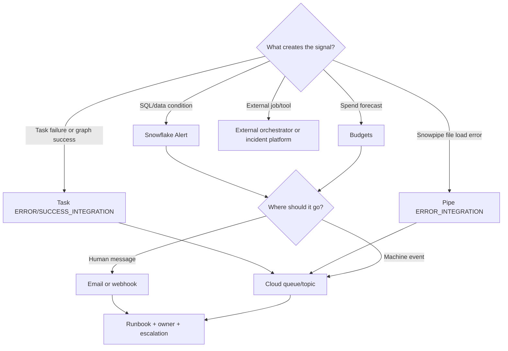

---
tags:
  - note-decision
---

# Decisions - Choosing a Snowflake Notification Pattern

> A framework for deciding whether to use Snowflake Alerts, direct notifications, task/Snowpipe notifications, budgets, or an external incident tool.

## Decision Frame

Clients usually do not ask for "a notification integration." They ask, **"How do we find out when something goes wrong?"** The right answer depends on what creates the signal, who needs to receive it, and whether the response is human, automated, or both.

The cleanest mental model:

- **Alert:** checks a SQL condition and runs an action.
- **Notification integration:** sends a message somewhere.
- **Task/Snowpipe notification:** built-in event signal from a Snowflake service.
- **Budget notification:** spend forecast signal.
- **Incident platform:** escalation, ownership, acknowledgement, deduplication, and response workflow.

## Deciding Axes

- **Signal source:** data condition, task execution, Snowpipe file load, cost/budget trend, or external orchestrator.
- **Recipient:** person, team, cloud queue, chat channel, PagerDuty-style endpoint, or automation.
- **Urgency:** informational, warning, or incident.
- **Payload shape:** human-readable email/message vs machine-readable event.
- **Frequency/noise:** rare exception vs high-volume event stream.
- **Actionability:** does the notification include a runbook and owner?

## Recommendation Table

| Situation | Recommend | Why | Watch-outs |
|---|---|---|---|
| Arbitrary Snowflake SQL condition should trigger action | Snowflake Alert | Native condition/action/schedule pattern | Must resume alert and control compute cost |
| Pipeline task fails | Task `ERROR_INTEGRATION` | Built-in failure signal | Cloud messaging only; duplicates possible |
| Task graph completes successfully | Root task `SUCCESS_INTEGRATION` | Signals full graph completion | Not for every standalone task success |
| Snowpipe file fails to load | Pipe `ERROR_INTEGRATION` | Built-in file-load failure details | Needs `ON_ERROR = SKIP_FILE`; duplicates possible |
| Spend is trending above plan | Budget notifications | Forecasting and spend-owner workflow | Not a hard stop by default |
| Warehouse compute must stop at threshold | Resource monitor | Native warehouse suspension behavior | Warehouse-only scope |
| Human-readable warning is enough | Email notification integration | Easy to understand | Verified recipients and noise control |
| Alert should route to Slack/Teams/PagerDuty-style workflow | Webhook notification integration | Fits operational response channels | Manage webhook secrets and payload format |
| Event should be consumed by automation | Cloud queue/topic notification integration | Machine-readable, scalable, retry-friendly | Consumers must be idempotent |
| Need acknowledgement, escalation, suppression, and on-call ownership | External incident platform | Snowflake can emit signal; incident tool manages response | Requires integration and process design |

## Questions To Ask

- What exactly should trigger the signal?
- Does Snowflake already emit this event, or do we need custom SQL?
- Who owns the response?
- Is this informational, warning, or incident-level?
- Should the message go to a person, queue, webhook, or incident platform?
- How do we prevent duplicates and alert fatigue?
- What is the runbook?
- How will the team know if notifications stop working?

## Related Learning Topics

- [[01 Snowflake/07 Ecosystem and Integration/37 Notification Integrations and Alerts]]
- [[01 Snowflake/04 Data Engineering/20 Streams and Tasks]]
- [[01 Snowflake/04 Data Engineering/22 Snowpipe]]
- [[01 Snowflake/06 Cost Management and Operations/34 Budgets]]
- [[01 Snowflake/01 Core Architecture and Concepts/05 Resource Monitors]]

## Related Comparisons and Scenarios

- [[80 Comparisons and Decision Notes/Comparisons/Comparison - Resource Monitors vs Budgets]]
- [[80 Comparisons and Decision Notes/Client Scenarios/Scenario - Daily Load Overwrote Good Data]]
- [[80 Comparisons and Decision Notes/Client Scenarios/Scenario - Trade Batch Must Be Validated Before Publication]]

## Sources To Revisit

- [Snowflake Docs: Alerts and Notifications overview](https://docs.snowflake.com/en/guides-overview-alerts)
- [Snowflake Docs: Notifications in Snowflake](https://docs.snowflake.com/en/user-guide/notifications/about-notifications)
- [Snowflake Docs: Setting up alerts based on data](https://docs.snowflake.com/en/user-guide/alerts)
- [Snowflake Docs: Set up task error notifications](https://docs.snowflake.com/en/user-guide/tasks-errors)
- [Snowflake Docs: Snowpipe error notifications](https://docs.snowflake.com/en/user-guide/data-load-snowpipe-errors)
