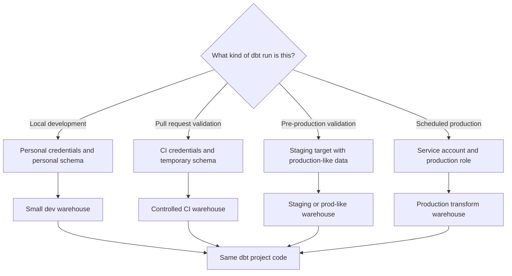

---
tags:
  - note-decision
---

# Decisions - Choosing a dbt Environment and Credential Strategy

> A framework for separating development, CI, staging, and production dbt execution without leaking secrets or widening Snowflake access.

## Decision Frame

Clients usually do not ask for "profiles.yml" directly. They ask: **"How do we let people develop safely while production stays controlled?"**

The answer depends on four design choices:

- **Runtime separation:** Which environments exist: dev, CI, staging, prod?
- **Object separation:** Which databases and schemas can each environment write to?
- **Identity separation:** Which user, role, service account, or platform credential runs each environment?
- **Compute separation:** Which warehouse and thread settings should each workload use?

The principle is simple: **same project code, different controlled runtime context.**

## Deciding Axes

- **Team maturity:** solo learning project, small analytics team, platform-managed production, or regulated enterprise.
- **Blast radius:** what could be overwritten if a target is misconfigured?
- **Credential model:** personal developer credentials, CI secret, dbt platform credential, service account, or workload identity.
- **Schema strategy:** personal schemas, PR-specific schemas, staging schemas, production schemas, or separate databases/accounts.
- **Warehouse strategy:** shared cheap dev warehouse, temporary CI warehouse, production transform warehouse, or workload-specific warehouses.
- **Promotion model:** local run, pull request, Slim CI, staging validation, scheduled deploy job, or orchestrated release.
- **Audit expectation:** casual team visibility, production run logs, regulated evidence, or formal change control.

## Recommendation Table

| Situation | Recommend | Why | Watch-outs |
|---|---|---|---|
| Individual learner or proof of concept | One `dev` target and personal schema | Fast to start and easy to understand | Do not use this as the production operating model |
| Multiple developers | Personal schemas such as `dbt_<username>` | Prevents overwrites and supports audit attribution | Needs cleanup and naming rules |
| Pull request checks | CI target with temporary or PR-specific schema | Validates changes without writing to shared marts | CI role should not have production write privileges |
| Production scheduled transformations | Dedicated production target/environment with service account | Stable, auditable, and independent of personal users | Rotate credentials and restrict privileges |
| Bank or regulated client | Separate dev, CI, staging, and prod identities, schemas, and roles | Reduces blast radius and supports evidence for change control | Requires platform ownership and documented promotion rules |
| Expensive test runs | Smaller CI warehouse, lower thread count, and Slim CI selection | Controls validation cost | Do not hide failures by testing too little |
| Sensitive production data | Use least-privilege roles and approved access paths | Prevents environment setup from bypassing governance | Confirm masking, row access, and role inheritance behavior |
| dbt Platform adoption | Use dbt environments and connection profiles | Centralizes credentials, job settings, and code version behavior | Still coordinate with Snowflake RBAC and warehouse strategy |
| Self-managed dbt Core or Fusion | Use `profiles.yml`, `env_var()`, CI secrets, and explicit targets | Portable and transparent for Git-based teams | Keep secrets out of repo, logs, and screenshots |

## Questions To Ask

- Which environments are required now, and which can wait?
- Can developers write to production objects in any path?
- Should dev, CI, staging, and prod use separate databases, schemas, accounts, or roles?
- Which identity runs production, and who owns it?
- How are secrets delivered locally, in CI, and in scheduled jobs?
- How are temporary CI schemas created and cleaned up?
- Which warehouse pays for each class of workload?
- What logs prove which code, user, role, and job produced a production table?
- Are any `target.name` branches changing business logic rather than runtime safety?

## Related Learning Topics

- [[02 dbt/01 Core Concepts and Project Structure/04 Environments Profiles Targets and Credentials]]
- [[02 dbt/05 Deployment CI CD and Operations/41 Dev CI Staging and Prod Environments]]
- [[02 dbt/05 Deployment CI CD and Operations/42 CI Jobs and Slim CI]]
- [[02 dbt/05 Deployment CI CD and Operations/47 Secrets Service Accounts and RBAC]]
- [[02 dbt/08 dbt on Snowflake and Finance Patterns/75 Snowflake RBAC for dbt]]
- [[02 dbt/08 dbt on Snowflake and Finance Patterns/76 Database Schema and Warehouse Strategy]]

## Related Comparisons and Scenarios

- [[80 Comparisons and Decision Notes/Decision Notes/Decisions - Choosing a Snowflake DevOps and Deployment Pattern]]
- [[80 Comparisons and Decision Notes/Comparisons/Comparison - dbt Projects on Snowflake vs dbt Platform]]
- [[80 Comparisons and Decision Notes/Client Scenarios/Scenario - Manual Snowflake Changes Keep Breaking Dev Test Prod Consistency]]

## Sources To Revisit

- [dbt Docs: About profiles.yml](https://docs.getdbt.com/docs/local/profiles.yml)
- [dbt Docs: dbt Core environments](https://docs.getdbt.com/docs/local/dbt-core-environments)
- [dbt Docs: dbt environments](https://docs.getdbt.com/docs/dbt-platform-environments)
- [dbt Docs: Deployment environments](https://docs.getdbt.com/docs/deploy/deploy-environments)
- [dbt Docs: About target variables](https://docs.getdbt.com/reference/dbt-jinja-functions/target)
- [dbt Docs: About env_var function](https://docs.getdbt.com/reference/dbt-jinja-functions/env_var)
