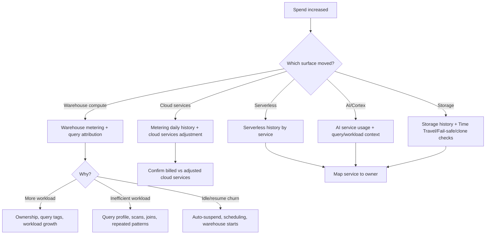

---
tags:
  - note-decision
---

# Decisions - Diagnosing Snowflake Spend Increases

> A framework for tracing Snowflake spend changes across warehouse compute, cloud services, serverless features, AI usage, storage, and operating patterns.

## Decision Frame

When a client says "Snowflake costs went up," do not start by resizing warehouses. First identify **which cost surface moved** and **whether it is billed cost, consumed credits, or attributed query cost**.

The practical sequence is:

1. Scope the time window and account/organization.
2. Split total usage by service type and cost category.
3. Separate warehouse compute from cloud services, serverless, AI/Cortex, storage, and data transfer.
4. Attribute warehouse spend to warehouses, users, roles, query tags, and query patterns.
5. Check operating controls: auto-suspend, warehouse starts, resource monitors, budgets, and ownership.
6. Turn the diagnosis into an accountable remediation plan.

## Deciding Axes

- **Billing level:** account, organization, department, warehouse, user, role, object, or tag.
- **Cost type:** warehouse compute, cloud services, serverless, AI services, storage, data transfer, or Marketplace/app consumption.
- **Time pattern:** one-time spike, gradual growth, weekday pattern, month-end batch, or always-on waste.
- **Attribution confidence:** query-attributed, warehouse-level, service-level, or only invoice-level.
- **Control type:** optimize, isolate, suspend, budget, resource monitor, schedule, tag, or alert.

## Recommendation Table

| Signal | Check first | Likely interpretation | First moves |
|---|---|---|---|
| Warehouse credits increased | `WAREHOUSE_METERING_HISTORY` | More warehouse runtime, larger size, more clusters, or more frequent starts | Split by warehouse, owner, workload, and time pattern |
| Same warehouse, more expensive queries | `QUERY_ATTRIBUTION_HISTORY` and `QUERY_HISTORY` | Query mix changed or repeated expensive queries grew | Use query tags, hashes, users, and profiles |
| Warehouses look normal but bill rose | `METERING_HISTORY`, service type, serverless histories | Serverless, AI, storage, data transfer, or cloud services may be driving spend | Break down by service type before blaming warehouses |
| Cloud services usage appears high | `METERING_DAILY_HISTORY` | Cloud services may be adjusted/billed only above threshold | Compare used, adjusted, and billed cloud services |
| Many short warehouse sessions | Warehouse metering and suspend/resume history | Auto-suspend too aggressive or workload bursts cause 60-second minimum churn | Tune schedule, consolidate bursts, or adjust suspend |
| Idle warehouses | Warehouse load/metering vs query activity | Warehouses running without useful work | Lower auto-suspend, fix jobs, resource monitor |
| Serverless feature spike | Service-specific Account Usage view | Automatic clustering, search optimization, tasks, Snowpipe, QAS, budgets, or SPCS | Map service to owner and business value |
| AI/Cortex spike | AI service usage and query context | Large prompt/function volume, repeated inference, or unbounded input | Add budget, sampling, caching, governance, and owner controls |
| Storage spike | `TABLE_STORAGE_METRICS` / storage histories | Time Travel, Fail-safe, dropped tables, clones, large loads, or retention settings | Review retention and dropped object footprint |
| Team says "we need a hard limit" | Resource monitor | Warehouse-level circuit breaker | Does not cover all services |
| Team says "warn me before overrun" | Budget | Monthly spend forecast and notification | Not a hard stop by default |

## Questions To Ask

- Is the increase visible in billed credits, consumed credits, or an internal chargeback report?
- Which account, warehouse, service, tag, or department changed?
- Did usage grow, or did the same workload become less efficient?
- Did new serverless, AI, SPCS, notebook, or Native App workloads launch?
- Are warehouses starting and suspending repeatedly?
- Are query tags and object tags good enough to attribute spend?
- Is the client asking for diagnosis, prevention, or enforcement?
- Which owner can change the workload after the cause is found?

## Related Learning Topics

- [[01 Snowflake/06 Cost Management and Operations/31 Credit Consumption Model]]
- [[01 Snowflake/06 Cost Management and Operations/32 Account Usage Views]]
- [[01 Snowflake/06 Cost Management and Operations/33 Warehouse Scheduling and Auto-suspend]]
- [[01 Snowflake/06 Cost Management and Operations/34 Budgets]]
- [[01 Snowflake/01 Core Architecture and Concepts/05 Resource Monitors]]
- [[01 Snowflake/07 Ecosystem and Integration/37 Notification Integrations and Alerts]]

## Related Comparisons and Scenarios

- [[80 Comparisons and Decision Notes/Comparisons/Comparison - Resource Monitors vs Budgets]]
- [[80 Comparisons and Decision Notes/Comparisons/Comparison - Account Usage Views vs Information Schema]]
- [[80 Comparisons and Decision Notes/Client Scenarios/Scenario - Snowflake Spend Increased but Warehouses Look Normal]]
- [[80 Comparisons and Decision Notes/Client Scenarios/Scenario - Snowflake Costs Spiked After Retention Change]]

## Sources To Revisit

- [Snowflake Docs: Exploring compute cost](https://docs.snowflake.com/en/user-guide/cost-exploring-compute)
- [Snowflake Docs: Account Usage](https://docs.snowflake.com/en/sql-reference/account-usage)
- [Snowflake Docs: WAREHOUSE_METERING_HISTORY](https://docs.snowflake.com/en/sql-reference/account-usage/warehouse_metering_history)
- [Snowflake Docs: QUERY_ATTRIBUTION_HISTORY](https://docs.snowflake.com/en/sql-reference/account-usage/query_attribution_history)
- [Snowflake Docs: METERING_DAILY_HISTORY](https://docs.snowflake.com/en/sql-reference/account-usage/metering_daily_history)
- [Snowflake Docs: Budgets](https://docs.snowflake.com/en/user-guide/budgets)
