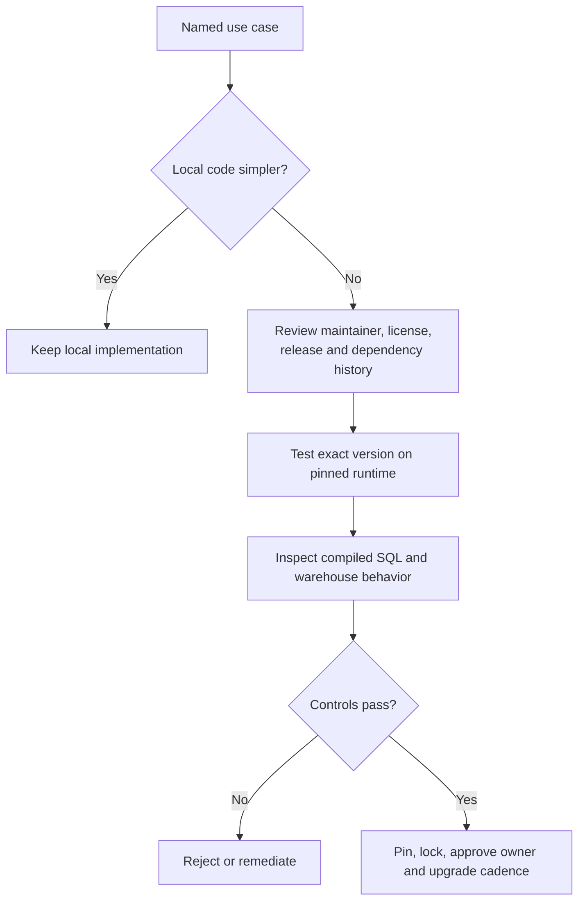

---
tags:
  - note-decision
---

# Decisions - Approving a dbt Package for Production

> Approve a package for a defined use case and pinned runtime, not because it is popular or appears on dbt Hub.

## Decision Frame

A dbt package becomes code inside the consuming project's parse, compile, and sometimes execution path. In production, package choice is therefore a software supply-chain and operating-ownership decision.

The decision should answer:

- Does the package solve a recurring problem better than a small local implementation?
- Is its scope narrow enough to understand and test?
- Who maintains the dependency and responds when it breaks?
- Has the exact version been tested on the client's dbt runtime and Snowflake adapter?
- Are license, provenance, transitive dependencies, network access, and generated SQL acceptable?

## Recommendation Table

| Situation | Recommend | Why | Watch-outs |
|---|---|---|---|
| Stable utility used repeatedly | Review and adopt a focused package | Reduces duplicated, well-understood code | Pin version and test generated SQL |
| Tiny requirement with a clear local macro | Keep it local | Lower dependency and upgrade burden | Assign internal ownership and tests |
| Package is inactive or archived | Avoid new adoption unless explicitly forked and owned | Security and compatibility fixes may not arrive | A fork makes the client the maintainer |
| Package adds many models or tests | Enable only required resources | Limits runtime, noise, and warehouse cost | Confirm selection behavior and defaults |
| Regulated production workload | Use formal approval evidence | Makes provenance and support boundaries auditable | Reassess on every material upgrade |
| Fusion or adapter migration | Run compatibility tests on the target runtime | Badges and documentation are screening evidence only | Include parse, compile, representative run, and rollback |
| Two Data Vault packages are being considered | Evaluate against the chosen modeling method and team skills | They encode different conventions and operating assumptions | Do not mix generators casually |

## Minimum Approval Record

| Field | Evidence |
|---|---|
| Business use case | Named models, tests, or operations that need it |
| Package identity | Repository, maintainer, license, exact version, checksum/lock |
| Health | Release history, issues, support status, security posture |
| Compatibility | dbt runtime, adapter, Snowflake features, dependent packages |
| Behavior | Compiled SQL, enabled resources, permissions, network calls |
| Cost | Additional models, tests, metadata queries, and schedules |
| Ownership | Internal owner, upgrade cadence, rollback and fork policy |

## Questions To Ask

- What repeated problem does this package solve?
- Could a small local macro be clearer and safer?
- Is the repository actively supported, and by whom?
- What code and resources become enabled by default?
- Does it query metadata, require elevated grants, or transmit anything externally?
- Has the locked version passed CI on the production runtime?
- Who owns upgrades, incidents, and a possible fork?

## Related Learning Topics

- [[02 dbt/07 Packages Macros and Advanced Reuse/60 Package Fundamentals]]
- [[02 dbt/07 Packages Macros and Advanced Reuse/62 Must-Have Utility Packages]]
- [[02 dbt/07 Packages Macros and Advanced Reuse/63 Data Quality Packages]]
- [[02 dbt/07 Packages Macros and Advanced Reuse/64 Snowflake and Operations Packages]]
- [[02 dbt/07 Packages Macros and Advanced Reuse/65 Finance and Bank-Relevant Packages]]
- [[02 dbt/07 Packages Macros and Advanced Reuse/66 Package Governance]]

## Related Comparisons and Scenarios

- [[80 Comparisons and Decision Notes/Comparisons/dbt/Comparison - dbt Packages vs Project Dependencies]]
- [[80 Comparisons and Decision Notes/Decision Notes/dbt/Decisions - Choosing a dbt Production Deployment Pattern]]

## Sources To Revisit

- [dbt Developer Hub - Packages](https://docs.getdbt.com/docs/build/packages)
- [dbt Developer Hub - Package management](https://docs.getdbt.com/docs/build/packages#how-do-i-add-a-package-to-my-project)
- [dbt Developer Hub - dbt deps](https://docs.getdbt.com/reference/commands/deps)
- [dbt Hub](https://hub.getdbt.com/)
