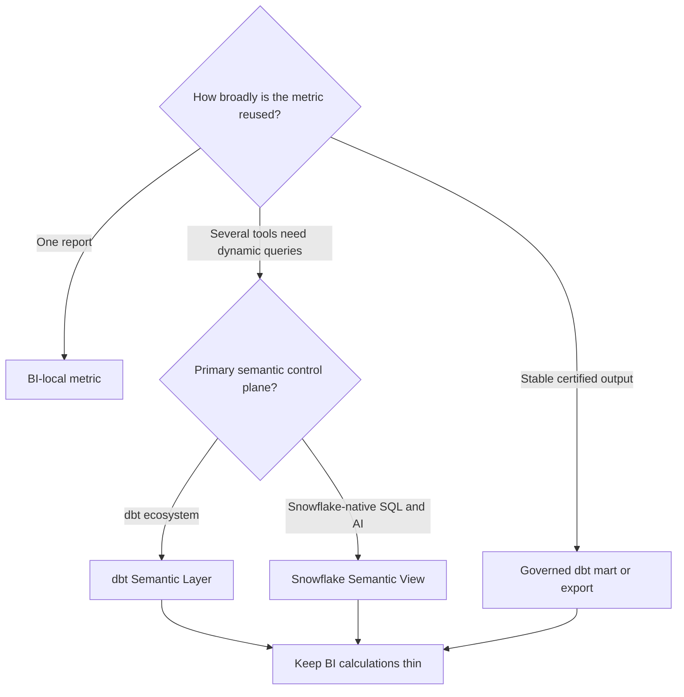

---
tags:
  - note-decision
---

# Decisions - Choosing Where Governed Metrics Should Live

> Put a metric in the narrowest layer that can govern every material consumer without creating a second conflicting source of truth.

## Decision Frame

Clients often have the same KPI implemented in warehouse SQL, dbt, several BI tools, and spreadsheets. The real decision is not which product has the best metric feature. It is:

- Which consumers must share the definition?
- Who owns the business meaning and change approval?
- Does the metric need dynamic slicing or a stable published table?
- Where can access control, lineage, testing, and cost be operated reliably?

The default rule is: **one authoritative definition, deliberate delivery patterns, and no silent copies.**

## Recommendation Table

| Situation | Recommend | Why | Watch-outs |
|---|---|---|---|
| One dashboard owns a low-risk calculation | BI metric initially | Lowest operating overhead | Promote it when reuse or disagreement appears |
| Several supported tools need the same dynamically sliced KPI | dbt Semantic Layer | Version-controlled metric graph and reusable query interface | Platform plan, integration coverage, credentials, generated-query cost |
| Snowflake-native SQL, Cortex, or applications are the main consumers | Snowflake Semantic Views | Native semantic object close to Snowflake governance and AI services | Do not maintain a conflicting MetricFlow definition |
| Consumers need a fixed, certified dataset | dbt mart, saved query, or export | Stable shape is easier to test, reconcile, and authorize | Less flexible; refresh and publication SLA matter |
| Underlying grain or business definition is disputed | Fix the model and ownership first | A semantic layer cannot repair ambiguous foundations | Do not publish a polished name over unreliable logic |
| Sensitive metric needs user-specific visibility | Chosen semantic layer plus Snowflake policies | Meaning and enforcement are separate responsibilities | Test every credential and consumption path |
| Two semantic systems must coexist during migration | Name one authoritative source and set a retirement date | Makes transition explicit | Automated reconciliation and consumer inventory are required |

## Deciding Axes

- **Reach:** one dashboard, one BI platform, several tools, APIs, notebooks, or AI consumers.
- **Query shape:** fixed publication versus dynamic dimensions, filters, and time grains.
- **Ownership:** named business approver, technical owner, and incident owner.
- **Control plane:** dbt-centric analytics engineering or Snowflake-native platform governance.
- **Security:** execution identity, masking, row access, and permitted dimensions.
- **Cost:** generated joins, caching, exports, refresh schedules, and high-cardinality slices.
- **Change:** semantic versioning, reconciliation, rollout, and retirement of duplicates.

## Questions To Ask

- Which consumers must agree on this metric?
- What grain, date basis, currency treatment, exclusions, and restatement policy define it?
- Who can approve a semantic change?
- Does the consumer need a dynamic metric query or a certified table?
- Which platform already owns identity, monitoring, and incident response?
- How will direct SQL and spreadsheet copies be discovered and retired?
- What evidence proves two definitions match during migration?

## Related Learning Topics

- [[02 dbt/06 Governance Semantic Layer and Mesh/55 Semantic Models and Metrics]]
- [[02 dbt/06 Governance Semantic Layer and Mesh/56 Semantic Layer vs BI Metrics vs Snowflake Semantic Views]]
- [[02 dbt/06 Governance Semantic Layer and Mesh/57 Metadata Lineage and Catalog Strategy]]
- [[02 dbt/06 Governance Semantic Layer and Mesh/59 Sensitive Data and Regulatory Boundaries]]
- [[02 dbt/02 Modeling Patterns and Layering/13 Marts and Data Products]]

## Related Comparisons and Scenarios

- [[80 Comparisons and Decision Notes/Client Scenarios/Snowflake/Scenario - Business Users Want Self-Service Analytics but Metrics Are Inconsistent]]
- [[80 Comparisons and Decision Notes/Comparisons/Cross-Tool/Comparison - dbt Projects on Snowflake vs dbt Platform]]

## Sources To Revisit

- [dbt Developer Hub - About the dbt Semantic Layer](https://docs.getdbt.com/docs/use-dbt-semantic-layer/dbt-sl)
- [dbt Developer Hub - Semantic models](https://docs.getdbt.com/docs/build/semantic-models)
- [Snowflake Documentation - Overview of semantic views](https://docs.snowflake.com/en/user-guide/views-semantic/overview)
