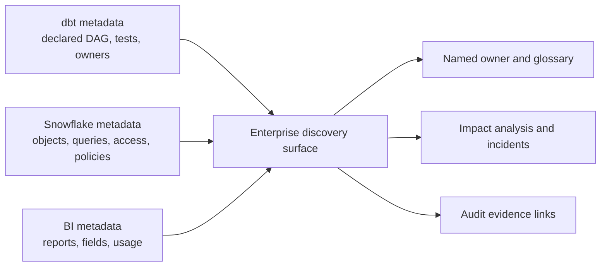

---
tags:
  - note-decision
---

# Decisions - Choosing a Catalog and Lineage Authority

> Use each metadata system for the evidence it observes directly, but name one enterprise discovery surface and one accountable owner for every critical asset.

## Decision Frame

dbt knows declared transformation dependencies and project metadata. Snowflake observes warehouse objects, queries, policies, and access. BI tools know reports and their local semantic dependencies. Enterprise catalogs connect wider business terminology and stewardship.

Trying to make one source capture everything usually creates gaps. Letting every source present itself as authoritative creates conflicting lineage and ownership. The practical target is **federated evidence with a clear discovery and stewardship model**.

## Recommendation Table

| Situation | Recommend | Why | Watch-outs |
|---|---|---|---|
| Small dbt-centric estate | Start with dbt Catalog and artifacts | Fastest useful view of modeled assets | Direct SQL and non-dbt transformations remain incomplete |
| Snowflake is the dominant platform | Use Horizon metadata for physical and observed lineage | Sees warehouse objects and activity beyond dbt | Business meaning and external BI lineage still need context |
| Several platforms and BI tools are material | Use an enterprise catalog as the discovery front door | Connects cross-system metadata and stewardship | Ingestion does not automatically make ownership accurate |
| Regulated impact analysis | Combine dbt declared lineage, Snowflake observed evidence, and BI metadata | No single graph sees every consumer | Capture source, timestamp, and confidence for each edge |
| Two catalogs overlap | Assign authoritative fields and synchronization rules | Prevents ownership and description conflicts | Avoid bidirectional overwrite loops |
| Critical model has unknown direct consumers | Use query/access evidence plus interviews before change | dbt lineage alone cannot find unmanaged SQL | Retention windows and dynamic SQL can limit evidence |

## Authority by Metadata Type

| Metadata | Preferred authority |
|---|---|
| dbt model definition, tests, group, and declared `ref()` lineage | dbt project and artifacts |
| Snowflake object, policy, tag, query, and access evidence | Snowflake metadata |
| Dashboard field, report owner, and BI usage | BI platform metadata |
| Business glossary, steward, certification, and cross-platform discovery | Governed enterprise catalog or agreed stewardship process |
| Control execution and sign-off evidence | Control or audit system, linked from the catalog |

## Questions To Ask

- Who is the primary user: developer, analyst, steward, auditor, or incident responder?
- Which systems create data outside dbt?
- Must lineage show declared intent, observed execution, or both?
- Which fields are authoritative in which system?
- How fresh must metadata be for safe impact analysis?
- How will direct SQL, dynamic queries, spreadsheets, and exports be handled?
- Who resolves conflicting owners, descriptions, or lineage edges?

## Related Learning Topics

- [[02 dbt/06 Governance Semantic Layer and Mesh/57 Metadata Lineage and Catalog Strategy]]
- [[02 dbt/06 Governance Semantic Layer and Mesh/50 Groups and Ownership]]
- [[02 dbt/06 Governance Semantic Layer and Mesh/54 dbt Mesh and Project Dependencies]]
- [[02 dbt/06 Governance Semantic Layer and Mesh/58 Domain Ownership in Banking]]
- [[01 Snowflake/08 Enterprise Snowflake in Production/54 Horizon Catalog, Lineage, and Access History]]

## Related Comparisons and Scenarios

- [[80 Comparisons and Decision Notes/Client Scenarios/dbt/Scenario - Team Cannot Tell Which Dashboards a Model Change Will Break]]
- [[80 Comparisons and Decision Notes/Decision Notes/dbt/Decisions - Designing dbt Observability and Incident Evidence]]

## Sources To Revisit

- [dbt Developer Hub - Explore dbt Catalog](https://docs.getdbt.com/docs/explore/explore-projects)
- [dbt Developer Hub - About dbt artifacts](https://docs.getdbt.com/reference/artifacts/dbt-artifacts)
- [Snowflake Documentation - Data Lineage](https://docs.snowflake.com/en/user-guide/ui-snowsight_lineage)
- [Snowflake Documentation - ACCESS_HISTORY view](https://docs.snowflake.com/en/sql-reference/account-usage/access_history)
