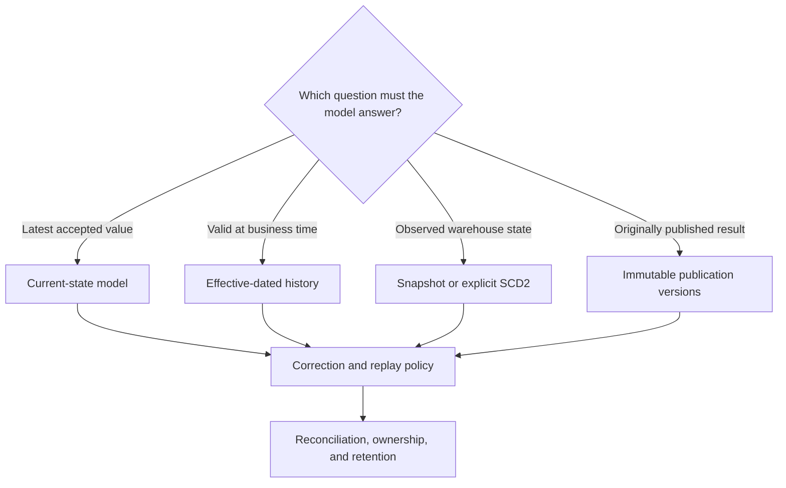

---
tags:
  - note-decision
---

# Decisions - Choosing a Data History and Restatement Pattern

> Choose history according to the question consumers must answer: latest truth, effective truth, what the warehouse observed, or what was officially published.

## Decision Frame

“Keep history” is not one requirement. A client may need to answer four different questions:

| Question | Required pattern |
|---|---|
| What is correct now? | Current-state model |
| What was valid in the business at a given time? | Business-effective history |
| What values did the warehouse observe over time? | Snapshot or other observed-history pattern |
| What did we officially report at a prior publication date? | Immutable as-reported publication versions |

These patterns may coexist. A controlled finance design often publishes a current corrected result while retaining previously issued versions.

## Deciding Axes

- **Business question:** latest, as-of-effective, as-observed, or as-reported?
- **Source behavior:** append-only events, explicit versions, CDC, or overwritten current state?
- **Time semantics:** event time, effective time, source update time, load time, and publication time.
- **Correction behavior:** replace, append a new version, reopen a period, or issue a formal restatement?
- **Completeness requirement:** Is observed history sufficient, or must every source change be captured?
- **Control level:** Operational analytics, management reporting, finance close, or regulatory publication?
- **Replay scope:** Can affected keys or periods be rebuilt, or is a full historical recalculation required?
- **Retention and cost:** How long must history and publication evidence remain queryable?

## Recommendation Table

| Situation | Recommend | Why | Watch-outs |
|---|---|---|---|
| Consumers only need the latest accepted value | Current-state table or incremental model | Simple and efficient | Historical reports may silently restate when attributes change |
| Source already stores events or explicit versions | Model that source history, often incrementally | Uses the most complete available evidence | Define ordering, duplicate, correction, and cancellation rules |
| Source overwrites rows and observed prior states are sufficient | dbt snapshot or explicit SCD2 capture | Preserves states seen by dbt | Snapshot cadence may miss intermediate changes and cannot reconstruct pre-observation history |
| Reporting must use the attribute valid at event time | Effective-dated model with tested as-of joins | Preserves business-time meaning | Test gaps, overlaps, late dimensions, and boundary conditions |
| Previously published finance or regulatory output can change | Immutable publication versions plus a governed restatement process | Preserves both current corrected truth and what was originally reported | Record reason, approval, superseded version, lineage, and consumer cutover |
| A late correction affects known periods or keys | Targeted replay plus reconciliation | Recalculates the necessary scope without rebuilding everything | Track affected scope and all downstream dependencies |
| Late changes are unpredictable | Incremental processing plus scheduled backfill or reconciliation | Balances routine efficiency with completeness | A fixed lookback alone is not a guarantee |
| Team needs to recover a recent bad load | Snowflake Time Travel | Supports operational recovery | It is not durable modeled history or publication evidence |

## Control Rules

- Store business-effective time separately from warehouse knowledge and publication time.
- Do not claim snapshot history is complete unless cadence and source behavior support that claim.
- Do not overwrite an officially published result when the business needs to reconstruct the original report.
- Pair late-change processing with reconciliation that detects records outside normal windows.
- Make the current version easy for consumers to identify without deleting superseded evidence.
- Assign ownership for correction approval, period reopening, restatement, and downstream communication.

## Consultant Recommendation Shape

> “Start with the question the consumer must answer. Use current-state models for latest truth, effective-dated history for business-time analysis, snapshots for states dbt actually observed, and immutable publication versions when previously issued results must remain auditable. None of these removes the need for correction, replay, and reconciliation controls.”

## Questions To Ask

- Must users see latest truth, business-effective truth, warehouse-observed truth, or as-reported truth?
- Does the source retain events and versions, or overwrite prior values?
- Which timestamps are reliable, and what does each one mean?
- Can intermediate changes occur between ingestion or snapshot runs?
- When may a closed period be reopened, and who approves it?
- Which downstream models must replay after a correction?
- How are current and superseded publication versions identified?
- What history and evidence retention period is required?

## Related Learning Topics

- [[02 dbt/01 Core Concepts and Project Structure/09 Snapshots and Historical Change Tracking]]
- [[02 dbt/02 Modeling Patterns and Layering/19 Late-arriving Data Corrections and Restatements]]
- [[02 dbt/02 Modeling Patterns and Layering/20 Reconciliation Models]]
- [[02 dbt/04 Incremental Processing and Performance/31 Incremental Models and Unique Keys]]
- [[02 dbt/04 Incremental Processing and Performance/33 Microbatch Incremental Models]]
- [[02 dbt/04 Incremental Processing and Performance/35 Snapshots vs Incremental Models vs Dynamic Tables]]
- [[02 dbt/04 Incremental Processing and Performance/39 Full Refreshes Backfills and Replay]]

## Related Comparisons and Decisions

- [[80 Comparisons and Decision Notes/Comparisons/dbt/Comparison - Snapshots vs Incremental Models]]
- [[80 Comparisons and Decision Notes/Comparisons/dbt/Comparison - Full Refresh vs Backfill vs Replay]]
- [[80 Comparisons and Decision Notes/Decision Notes/dbt/Decisions - Choosing a dbt Incremental Strategy on Snowflake]]
- [[80 Comparisons and Decision Notes/Comparisons/Cross-Tool/Comparison - Time Travel vs Modeled Historical Data]]

## Sources To Revisit

- [dbt Labs: Snapshots](https://docs.getdbt.com/docs/build/snapshots)
- [dbt Labs: Configure incremental models](https://docs.getdbt.com/docs/build/incremental-models)
- [Snowflake Docs: Understanding and using Time Travel](https://docs.snowflake.com/en/user-guide/data-time-travel)
