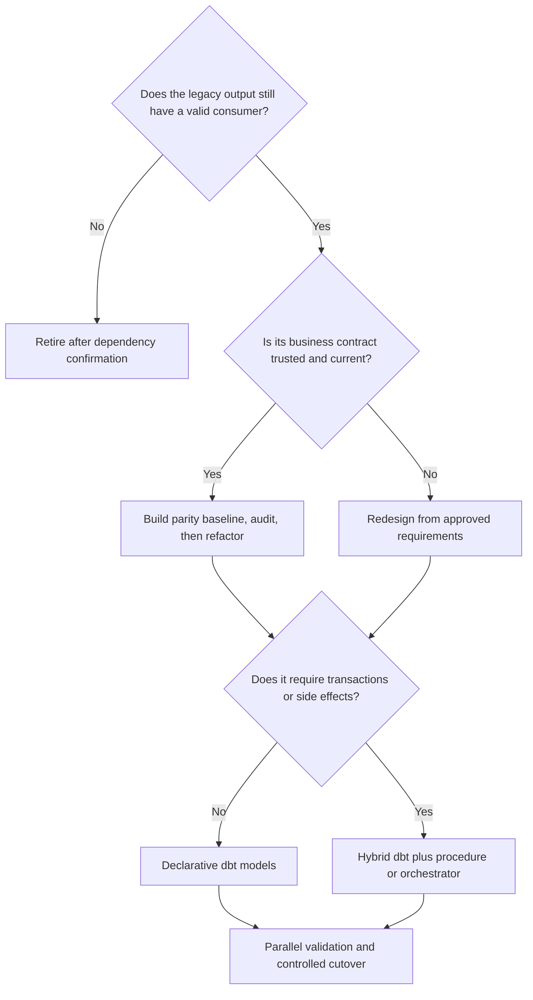

---
tags:
  - note-decision
---

# Decisions - Choosing a Legacy SQL-to-dbt Migration Strategy

> Migrate business value, not every legacy object: retire what is unused, preserve trusted behavior where necessary, redesign where justified, and keep procedural responsibilities at an explicit boundary.

## Decision Frame

The client question is not simply, “How do we translate this SQL into dbt?” It is:

> “Which legacy behavior deserves to survive, how much should change during migration, and what evidence makes cutover safe?”

A migration can use several strategies within the same estate:

- **Eliminate:** retire outputs with no valid consumers or business purpose.
- **Parity first:** reproduce a trusted output, prove equivalence, then refactor safely.
- **Redesign:** rebuild from current business requirements when the legacy structure or meaning is no longer defensible.
- **Hybrid:** move declarative transformations into dbt while retaining procedures or orchestration for transactions and side effects.

## Deciding Axes

- **Business value:** Which consumers, controls, or reports still depend on the output?
- **Contract confidence:** Are grain, population, calculations, timing, and edge cases understood?
- **Legacy quality:** Is the logic trusted, merely familiar, or known to be defective?
- **Procedural behavior:** Does it depend on ordered DML, transactions, branching, quarantine, audit writes, or notifications?
- **Criticality:** What is the financial, regulatory, or operational impact of a difference?
- **Validation evidence:** Can old and new outputs be compared by keys, aggregates, rows, and representative cycles?
- **Change capacity:** Can business owners approve a redesign now, or must architecture and semantics change separately?
- **Cutover risk:** Are consumers, monitoring, rollback, and a retirement date defined?

## Recommendation Table

| Situation | Recommend | Why | Watch-outs |
|---|---|---|---|
| Output has no valid consumer | Eliminate it | Reduces migration scope and future maintenance | Confirm dependencies, schedules, exports, and manual consumers first |
| Trusted business-critical logic must remain stable | Parity-first translation, then incremental refactoring | Separates migration risk from architectural improvement | Do not leave the parity model as a permanent monolith |
| Legacy result is useful but SQL is tangled | Capture the contract, build parity, then split at meaningful boundaries | Preserves behavior while improving maintainability | Avoid one dbt model per temporary table |
| Requirements changed or legacy semantics are not defensible | Redesign from approved business requirements | Avoids reproducing obsolete assumptions | Requires ownership, acceptance criteria, and explicit treatment of historical comparability |
| Process is primarily set-based transformation | Move it into dbt models | Improves lineage, testing, documentation, and reviewability | Use `source()` and `ref()` and declare model grains |
| Process requires multi-table transactions or operational side effects | Use a hybrid boundary | Keeps declarative data logic in dbt without pretending it owns procedural guarantees | Define orchestration, idempotency, error propagation, and ownership |
| Large estate with a fixed deadline | Migrate in risk-based waves | Creates repeatable learning and limits blast radius | Do not prioritize only by SQL size; include business criticality and dependency depth |
| Finance or regulatory output | Parallel run, reconciliation, approval, rollback, and retirement controls | Produces defensible cutover evidence | Cover month-end, late data, corrections, and material differences |

## Migration Control Pattern

1. Inventory dependencies, consumers, side effects, owners, and runtime behavior.
2. Triage each process as eliminate, parity-first, redesign, or hybrid.
3. Record the legacy output contract and representative edge cases.
4. Build and audit the dbt replacement without mixing unexplained semantic changes into the migration.
5. Run both paths through representative business cycles.
6. Classify every material difference as intended improvement, legacy defect, dbt regression, or unresolved policy question.
7. Cut over with monitoring and rollback, then retire the legacy path on a defined date.

Validate in layers: align the source cutoff, compare schema and grain, then counts, keys, row values, control totals, business invariants, and representative operating cycles. Maintain an accepted-differences register with the reason, affected population, quantitative impact, owner, approval, and evidence; any unexplained material difference blocks cutover.

## Consultant Recommendation Shape

> “Start by deciding which outputs still deserve to exist. For trusted critical logic, establish parity before refactoring. Redesign only from approved requirements, keep transactional side effects at an explicit procedural boundary, and require evidence-based cutover rather than treating translated SQL as proof of success.”

## Questions To Ask

- Which outputs still have real consumers, and how were those dependencies verified?
- What does one output row mean, and which calculations or edge cases are contractual?
- Which legacy behaviors are intentional, accidental, or unknown?
- Does the process describe a dataset or coordinate ordered side effects?
- Which differences are acceptable, and who can approve them?
- Which daily, month-end, late-data, and correction cycles must parallel validation cover?
- What is the rollback plan, and when will the legacy pipeline be retired?

## Related Learning Topics

- [[02 dbt/02 Modeling Patterns and Layering/11 Staging Models]]
- [[02 dbt/02 Modeling Patterns and Layering/12 Intermediate Models]]
- [[02 dbt/02 Modeling Patterns and Layering/13 Marts and Data Products]]
- [[02 dbt/02 Modeling Patterns and Layering/17 Refactoring Legacy SQL into dbt]]
- [[02 dbt/02 Modeling Patterns and Layering/20 Reconciliation Models]]
- [[02 dbt/03 Testing Documentation and Data Quality/28 Audit and Migration Validation]]

## Related Comparisons and Decisions

- [[80 Comparisons and Decision Notes/Decision Notes/dbt/Decisions - Choosing the Right dbt Modeling Layer]]
- [[80 Comparisons and Decision Notes/Decision Notes/dbt/Decisions - Choosing the Right dbt Quality Control]]
- [[80 Comparisons and Decision Notes/Comparisons/Cross-Tool/Comparison - Stored Procedures vs Declarative Transformations]]

## Sources To Revisit

- [dbt Labs: Refactoring legacy SQL to dbt](https://www.getdbt.com/blog/sql-refactoring-course)
- [dbt Labs: Start fresh, don't lift and shift](https://www.getdbt.com/blog/start-fresh-don-t-lift-and-shift-a-dbt-migration-guide)
- [dbt Labs: From stored procedures to dbt](https://www.getdbt.com/blog/stored-procedures-dbt-migration-playbook)
- [dbt Labs: audit_helper](https://github.com/dbt-labs/dbt-audit-helper)
