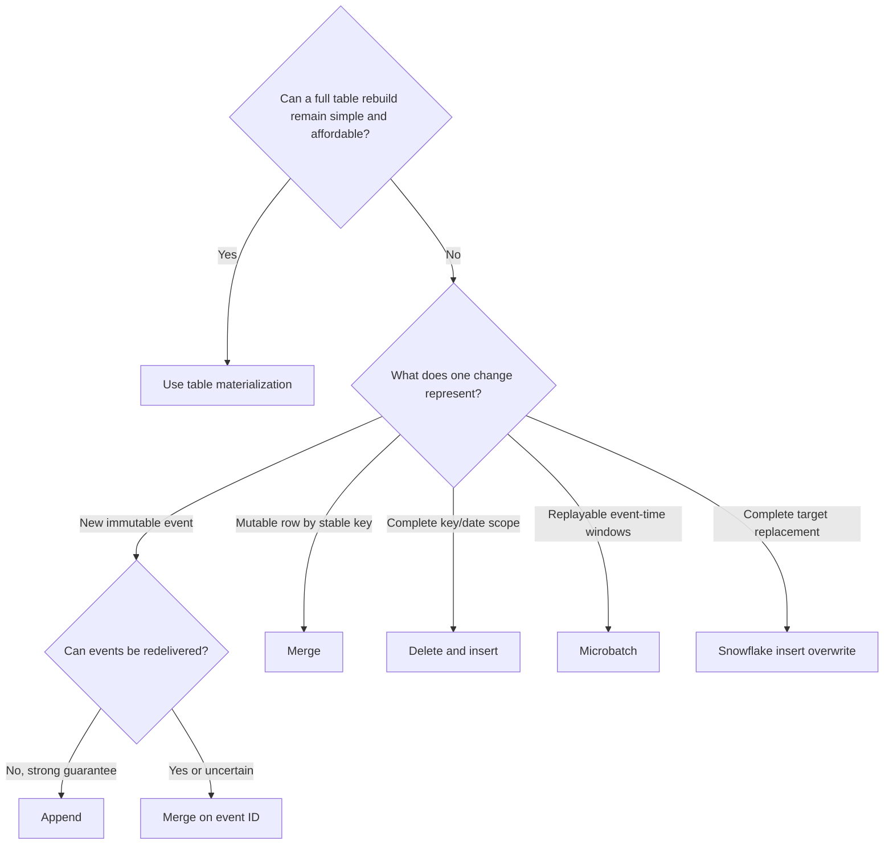

---
tags:
  - note-decision
---

# Decisions - Choosing a dbt Incremental Strategy on Snowflake

> After choosing incremental materialization, match the write strategy to source mutability, target grain, replacement scope, and replay requirements.

## Decision Frame

An incremental filter decides **which source rows are processed**. The incremental strategy decides **how that change set modifies the existing target**.

Start with source behavior and recovery requirements, not with the most familiar strategy.

## Recommendation Table

| Situation | Recommend | Why | Watch-outs |
|---|---|---|---|
| Full rebuild is still cheap | Normal `table` | Simplest recovery and reproducibility | Reassess only when measured cost or duration becomes material |
| Immutable events with guaranteed exactly-once delivery | `append` | Avoids target matching overhead | A broken delivery guarantee creates duplicates |
| Immutable events can arrive late or be replayed | `merge` on stable `event_id` | Preserves every event while making redelivery idempotent | Reject conflicting payloads for the same event ID |
| Mutable current-state rows with a reliable key | `merge` | Updates matches and inserts new entities | Null/duplicate keys, deletes, source filters, and target scans |
| Complete business dates or key groups are recalculated | `delete+insert` | Replaces a known complete scope predictably | Never delete before proving the incoming scope is complete |
| Very large time-series data has reliable UTC event time | `microbatch` | Provides bounded backfill, retry, replacement, and possible parallelism | Batch independence, parent filtering, lookback, and warehouse concurrency |
| Entire Snowflake target should be replaced without normal incremental matching | `insert_overwrite` | Replaces all table contents intentionally | On Snowflake this is not partition overwrite; input must be complete |
| Source overwrites rows but prior states are required | Snapshot, CDC, or explicit versioning before incremental loading | Incremental merge alone overwrites target history | Observation cadence and source history retention |
| Large merge has a provably bounded target match range | Add `incremental_predicates` carefully | Can reduce target scanning | Exceptions outside the range can create missed matches or duplicates |
| Late changes are unbounded | Add reconciliation and targeted replay, regardless of strategy | A fixed lookback cannot guarantee completeness | Define detection, ownership, SLA, and downstream impact |

## Control Rules

- Define and test the target grain before selecting a unique key.
- Separate event time, source update time, and warehouse load time.
- Make replay idempotent: the same change set should leave the same correct target state.
- Use append only when duplicate delivery and reprocessing are genuinely controlled.
- Treat deletes explicitly through tombstones, source CDC, scoped replacement, or another governed rule.
- Prove that every delete-and-insert or batch replacement input is complete before removing target data.
- Pair bounded lookbacks with reconciliation capable of detecting older exceptions.
- Document full-refresh, backfill, and rollback procedures for every stateful production model.

## Questions To Ask

- Does the source append events, mutate current rows, or deliver complete replacement scopes?
- What key identifies one target row, and can it ever be null or duplicated?
- Can the source redeliver, reorder, correct, or delete records?
- Which timestamp reliably detects changes, and which timestamp defines business time?
- Is event-time processing naturally divisible into independent windows?
- Must retries and historical backfills produce an identical final result?
- How much of the existing target must Snowflake scan to apply the change?
- What process catches changes outside the normal lookback?

## Related Learning Topics

- [[02 dbt/04 Incremental Processing and Performance/31 Incremental Models and Unique Keys]]
- [[02 dbt/04 Incremental Processing and Performance/32 Incremental Strategies]]
- [[02 dbt/04 Incremental Processing and Performance/33 Microbatch Incremental Models]]
- [[02 dbt/04 Incremental Processing and Performance/34 Parallel Microbatch Execution]]
- [[02 dbt/04 Incremental Processing and Performance/39 Full Refreshes Backfills and Replay]]

## Related Comparisons and Decisions

- [[80 Comparisons and Decision Notes/Decision Notes/dbt/Decisions - Choosing a dbt Materialization and Refresh Pattern]]
- [[80 Comparisons and Decision Notes/Comparisons/dbt/Comparison - Snapshots vs Incremental Models]]
- [[80 Comparisons and Decision Notes/Comparisons/dbt/Comparison - Full Refresh vs Backfill vs Replay]]
- [[80 Comparisons and Decision Notes/Decision Notes/dbt/Decisions - Choosing a Data History and Restatement Pattern]]

## Sources To Revisit

- [dbt Developer Hub - Incremental strategy](https://docs.getdbt.com/docs/build/incremental-strategy)
- [dbt Developer Hub - Configure incremental models](https://docs.getdbt.com/docs/build/incremental-models)
- [dbt Developer Hub - Microbatch incremental models](https://docs.getdbt.com/docs/build/incremental-microbatch)
- [dbt Developer Hub - Snowflake configurations](https://docs.getdbt.com/reference/resource-configs/snowflake-configs)
