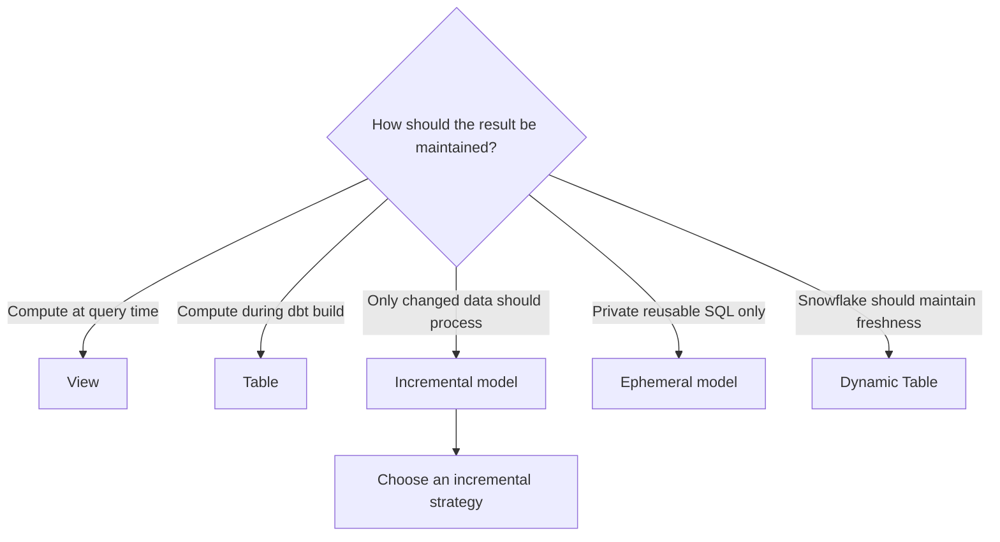

---
tags:
  - note-decision
---

# Decisions - Choosing a dbt Materialization and Refresh Pattern

> Choose where transformation work happens, how often it is repeated, and whether dbt or Snowflake owns refresh execution.

## Decision Frame

The first question is not "Which materialization is fastest?" It is:

> **Should this logic be computed when dbt builds, when a consumer queries, or through a platform-managed refresh?**

Choose the simplest pattern that meets measured freshness, performance, recovery, governance, and cost requirements. Materialization is an operating decision: it moves compute and responsibility between build time, query time, downstream consumers, and Snowflake.

## Recommendation Table

| Situation | Recommend | Why | Watch-outs |
|---|---|---|---|
| Lightweight source cleanup with modest reuse | `view` | Simple, current, and storage-light | View chains can repeat expensive work for every consumer |
| Governed mart or frequently queried result | `table` | Predictable reads and visible persisted state | Full rebuild time, staleness, and recovery |
| Small table that rebuilds cheaply | `table` | Stateless and easy to reproduce | Do not add incremental complexity prematurely |
| Very large fact with a reliable change set | `incremental` | Limits routine source processing | Keys, late data, deletes, backfills, and reconciliation |
| Small private helper used by few models | `ephemeral` | Reuses SQL without another relation | Compiled-query size, repeated work, weak discoverability, and no direct tests/contracts |
| Expensive intermediate reused many times | Usually `table` | Computes shared logic once per build | Confirm reuse justifies persistence and storage |
| Snowflake should maintain a declarative freshness target | Evaluate `dynamic_table` | Delegates dependency refresh and target-lag operation | SQL support, refresh mode, cost, monitoring, and platform lock-in |
| Mutable source overwrites values and history is required | Snapshot or source CDC before choosing the serving materialization | History capture is different from refresh optimization | Snapshot cadence and CDC ordering/retention |
| Regulated or published result | Usually a controlled `table`; use incremental only when scale requires it | Makes publication state and reconciliation explicit | Immutable publication evidence may still be required |
| Model logic changes rapidly during early development | Start with `view` or `table` | Keeps iteration and recovery simple | Reassess after workload behavior is measured |

## Deciding Axes

- **Consumer behavior:** How often is the model queried, and what latency is acceptable?
- **Build behavior:** How much data changes, and how expensive is full reconstruction?
- **Freshness ownership:** Should dbt scheduling or Snowflake target lag own refresh?
- **Reuse:** Is the logic private to one path or shared by many consumers?
- **Observability:** Does the model need a directly testable, contractable, discoverable relation?
- **Recovery:** Can the result be rebuilt, backfilled, or replayed safely?
- **Governance:** Is this an intermediate calculation, governed mart, or published result?
- **Portability:** Is Snowflake-specific platform behavior acceptable?

## Control Rules

- Prefer a normal table while full reconstruction remains cheap and predictable.
- Do not use incremental merely because the source is large; require a trustworthy change boundary and recovery design.
- Do not use ephemeral for governed interfaces or logic reused across many branches.
- Treat Dynamic Tables as Snowflake-owned refresh, not automatic history capture.
- Measure total workload cost: moving compute away from dbt build time can move it to every consumer query.
- Define full-refresh and backfill policy before approving a stateful production materialization.

## Questions To Ask

- Where should compute happen: build time, query time, or platform-managed refresh?
- What freshness promise do consumers actually need?
- Does the source retain complete history and reliable change signals?
- How long does a full rebuild take today, and how will it scale?
- Is the model reused enough to justify persistence?
- Who owns refresh failures, backfills, warehouse cost, and monitoring?
- Must the output be directly testable, versioned, contracted, or retained as publication evidence?

## Related Learning Topics

- [[02 dbt/04 Incremental Processing and Performance/30 Materializations]]
- [[02 dbt/04 Incremental Processing and Performance/31 Incremental Models and Unique Keys]]
- [[02 dbt/04 Incremental Processing and Performance/35 Snapshots vs Incremental Models vs Dynamic Tables]]
- [[02 dbt/04 Incremental Processing and Performance/38 Query Tuning Feedback Loop]]

## Related Comparisons and Decisions

- [[80 Comparisons and Decision Notes/Decision Notes/dbt/Decisions - Choosing a dbt Incremental Strategy on Snowflake]]
- [[80 Comparisons and Decision Notes/Comparisons/Snowflake/Comparison - Materialized Views vs Dynamic Tables]]
- [[80 Comparisons and Decision Notes/Comparisons/Snowflake/Comparison - Streams and Tasks vs Dynamic Tables]]

## Sources To Revisit

- [dbt Developer Hub - Materializations](https://docs.getdbt.com/docs/build/materializations)
- [dbt Developer Hub - Configure incremental models](https://docs.getdbt.com/docs/build/incremental-models)
- [dbt Developer Hub - Snowflake configurations](https://docs.getdbt.com/reference/resource-configs/snowflake-configs)
- [Snowflake Documentation - Dynamic Tables](https://docs.snowflake.com/en/user-guide/dynamic-tables/overview)
