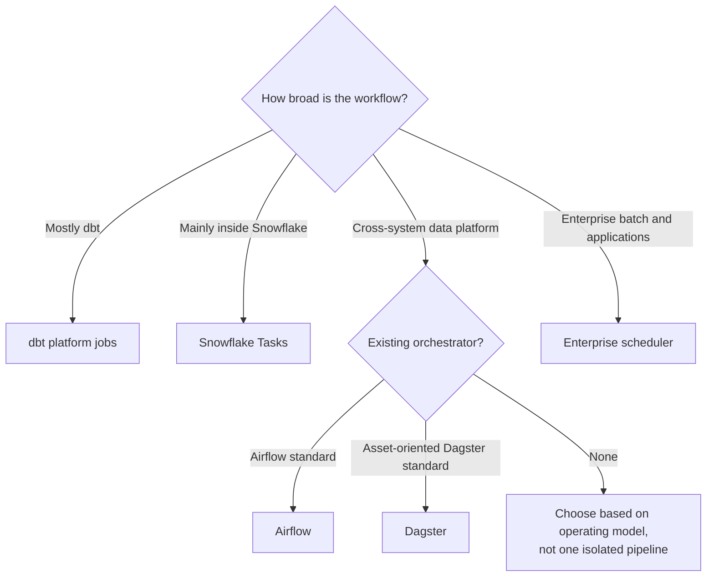

---
tags:
  - note-decision
---

# Decisions - Choosing a dbt Scheduling and Orchestration Pattern

> Choose the smallest reliable control plane that coordinates the real workflow, preserves required evidence, and has one accountable production owner.

## Decision Frame

Clients often ask, **"Should dbt schedule itself, run from Snowflake Tasks, or be controlled by our existing orchestrator?"**

The answer depends less on feature count than on workflow scope and operating ownership:

- Is the workflow mainly dbt, entirely inside Snowflake, or broadly cross-system?
- Which platform does the client already operate reliably?
- Are source readiness, business calendars, approvals, backfills, and publication gates required?
- Which team owns retries, alerts, credentials, upgrades, and incidents?
- What evidence must be retained across the end-to-end batch?

The principle is: **let dbt own its model DAG and let one authoritative control plane own the wider workflow.**

## Deciding Axes

- **Workflow scope:** dbt-only, Snowflake-contained, data-platform-wide, or enterprise-wide.
- **Trigger:** clock, data arrival, job completion, API, merge, file, or business event.
- **Recovery:** simple retry, partition backfill, checkpoint restart, manual approval, or cross-system compensation.
- **Existing standard:** dbt platform, Snowflake, Airflow, Dagster, or enterprise scheduler.
- **Operating skills:** analytics engineering, Snowflake administration, Python platform engineering, or central batch operations.
- **Governance:** identity separation, controlled overrides, retained logs, calendars, SLAs, and regulatory evidence.
- **Cost:** platform license, engineering operations, runner/control-plane infrastructure, Snowflake compute, and duplicated execution.
- **Granularity:** one logical dbt workload versus externally recreating the model DAG.

## Recommendation Table

| Situation | Recommend | Why | Watch-outs |
|---|---|---|---|
| dbt is the main production workload | dbt platform jobs | Managed dbt runtime, triggers, logs, artifacts, and simple dependencies | Wider cross-system workflow may outgrow it |
| All important steps execute in Snowflake | Snowflake Tasks | Native task graphs, RBAC, monitoring, and compute | External dependencies and complex recovery |
| Airflow is already a mature client standard | Airflow triggers logical dbt workloads | Broad integrations and established ownership | Duplicating dbt's DAG and Airflow operating cost |
| Client intentionally wants an asset-oriented platform | Evaluate Dagster | Asset, partition, lineage, and testability model | Team skills, integration maturity, platform ownership |
| Bank has mandated enterprise batch operations | Enterprise scheduler owns end-to-end; invoke dbt as a governed job | Fits business calendars, SLAs, applications, files, and central audit | Preserve dbt-level artifacts and diagnostics |
| One simple recurring dbt build | Existing managed dbt or Snowflake scheduler | Smallest sufficient solution | Do not skip alerts, timeouts, identity, and ownership |
| Source completion is unpredictable | Event/dependency trigger plus timeout monitoring | Avoids running against incomplete input | Lost, late, and duplicate events |
| Historical replay is common | Orchestrator with explicit partitions/parameters and idempotent dbt logic | Makes backfills controlled and observable | State, side effects, exports, and downstream reprocessing |
| Multiple schedulers run the same models | Consolidate under one authoritative controller | Prevents overlap and split incidents | Transition plan and dependency inventory |

## Questions To Ask

- What business event means the data is ready to transform?
- What is the required freshness, completion time, and recovery objective?
- Which systems participate before and after dbt?
- Which tool already owns enterprise schedules, holidays, files, or application dependencies?
- Does the workflow need sensors, branching, manual gates, partition backfills, or checkpoint restart?
- Who operates the control plane and responds at 03:00?
- Can retrying the same logical date create duplicates or repeated side effects?
- Which failures block publication?
- Which identity starts dbt, and what Snowflake privileges does it inherit?
- Are dbt artifacts, logs, parameters, and downstream outcomes linked in one audit trail?
- Can one tool be named as the authoritative trigger and incident owner?

## Related Learning Topics

- [[02 dbt/05 Deployment CI CD and Operations/44 Scheduling and Orchestration]]
- [[02 dbt/05 Deployment CI CD and Operations/43 Deploy Jobs and Merge Jobs]]
- [[02 dbt/05 Deployment CI CD and Operations/45 Artifacts Logs and Run Results]]
- [[02 dbt/05 Deployment CI CD and Operations/48 Incident Response Rollback and Replay]]
- [[01 Snowflake/04 Data Engineering/20 Streams and Tasks]]
- [[01 Snowflake/04 Data Engineering/25 dbt on Snowflake]]

## Related Comparisons and Scenarios

- [[80 Comparisons and Decision Notes/Comparisons/Cross-Tool/Comparison - dbt Projects on Snowflake vs dbt Platform]]
- [[80 Comparisons and Decision Notes/Decision Notes/Cross-Tool/Decisions - Choosing a Snowflake DevOps and Deployment Pattern]]
- [[80 Comparisons and Decision Notes/Client Scenarios/Cross-Tool/Scenario - Manual Snowflake Changes Keep Breaking Dev Test Prod Consistency]]

## Sources To Revisit

- [dbt Developer Hub - Job scheduler](https://docs.getdbt.com/docs/deploy/job-scheduler)
- [Snowflake Docs - Introduction to Tasks](https://docs.snowflake.com/en/user-guide/tasks-intro)
- [Apache Airflow - Architecture overview](https://airflow.apache.org/docs/apache-airflow/stable/core-concepts/overview.html)
- [Dagster Docs - Overview](https://docs.dagster.io/)
