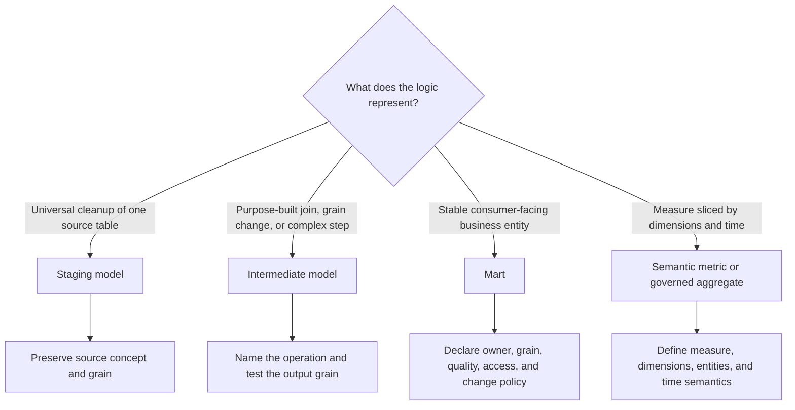

---
tags:
  - note-decision
---

# Decisions - Choosing the Right dbt Modeling Layer

> Place logic according to what it means: universal source cleanup belongs in staging, purpose-built preparation belongs in intermediate models, and stable business interfaces belong in marts.

## Decision Frame

Clients usually do not ask, "Which dbt folder should contain this SQL?" They ask: **"Where should this rule live so it is reusable, understandable, governed, and safe to change?"**

The core decision is whether the logic describes:

- A universally useful cleanup of one source table
- An internal transformation step with a specific purpose
- A stable business entity or output intended for consumers
- A measure that should be calculated through a semantic or metrics layer

## Deciding Axes

- **Source alignment:** Does the transformation still represent one raw source table?
- **Universality:** Should every downstream consumer inherit the rule?
- **Grain:** Does the transformation preserve, collapse, or fan out rows?
- **Purpose:** Can the operation be named clearly with a verb?
- **Consumer intent:** Is the output safe for durable dashboard, application, or cross-team dependencies?
- **Stability:** Is the schema an internal detail or a managed interface?
- **Governance:** Does the model need ownership, contracts, versions, access policies, or reconciliation?
- **Materialization:** Does the logic need a warehouse object for inspection, reuse, performance, or consumption?

## Recommendation Table

| Situation | Recommend | Why | Watch-outs |
|---|---|---|---|
| Rename, cast, and standardize one raw table for every use case | Staging model | Creates one governed source-aligned entry point | Preserve source grain and avoid business-specific rules |
| Join entities, deduplicate, pivot, or change grain for downstream construction | Intermediate model | Makes a risky or complex operation visible and testable | State input and output grains and prevent row multiplication |
| Small logic is used once and remains readable | Keep it as a CTE | Avoids unnecessary DAG complexity | Extract it when it deserves tests, reuse, ownership, or performance control |
| Consumers need a stable order, customer, trade, position, or account dataset | Mart | Publishes an owned business interface at a declared grain | Add documentation, tests, access, lineage, and change management |
| Several dashboards build the same entity differently | Shared mart | Centralizes the definition and repeated joins | Resolve genuine definition conflicts rather than hiding them |
| Daily or monthly rollup is mainly a measure sliced by dimensions | Semantic metric or governed aggregate | Separates metric semantics from entity storage | Decide whether performance or regulatory evidence requires a persisted output |
| Internal logic is small and does not need direct inspection | Ephemeral intermediate model | Provides a reusable named CTE without a warehouse object | Recomputed downstream and harder to troubleshoot; never a consumer-facing mart |
| Internal logic needs inspection but little storage | Intermediate view in a restricted schema | Supports debugging and control review | Deep view chains can increase compute and query complexity |
| Expensive logic is repeatedly evaluated | Measured persistent intermediate or mart | Can reduce repeated compute | Adds freshness, rebuild, storage, backfill, and recovery obligations |
| Public mart schema is relied on by other teams or systems | Contract, controlled access, and possibly versions | Makes interface promises and breaking changes explicit | Governance overhead should match real dependency risk |
| Finance or regulatory output applies controlled rules | Governed mart plus reconciliation and evidence | Treats the output as a controlled data product | Technical tests alone do not prove business correctness |

## Questions To Ask

- Does the logic still describe one source table, or has it become business-conformed?
- Should every downstream consumer inherit this transformation?
- What are the input and output grains?
- Is this a reusable operation, or merely a small CTE in one model?
- Would an analyst or application team be encouraged to depend on the output?
- Who owns the definition, and how stable must its columns and meanings be?
- Does the output need direct Snowflake inspection or can it remain ephemeral?
- Is persistence justified by measured compute or runtime rather than convention?
- Which tests prove technical grain, and which reconciliations prove business correctness?
- Would a semantic metric express the calculation better than another physical mart?
- Which sensitive fields and access policies cross into the published layer?

## Related Learning Topics

- [[02 dbt/02 Modeling Patterns and Layering/11 Staging Models]]
- [[02 dbt/02 Modeling Patterns and Layering/12 Intermediate Models]]
- [[02 dbt/02 Modeling Patterns and Layering/13 Marts and Data Products]]
- [[02 dbt/02 Modeling Patterns and Layering/14 Dimensional Modeling with dbt]]
- [[02 dbt/02 Modeling Patterns and Layering/16 Naming Conventions and Folder Design]]
- [[02 dbt/04 Incremental Processing and Performance/30 Materializations]]
- [[02 dbt/06 Governance Semantic Layer and Mesh/51 Model Access]]
- [[02 dbt/06 Governance Semantic Layer and Mesh/52 Model Contracts]]
- [[02 dbt/06 Governance Semantic Layer and Mesh/55 Semantic Models and Metrics]]

## Related Comparisons and Scenarios

- [[80 Comparisons and Decision Notes/Decision Notes/Snowflake/Decisions - Diagnosing Slow Snowflake Queries]]
- [[80 Comparisons and Decision Notes/Client Scenarios/dbt/Scenario - Team Cannot Tell Which Dashboards a Model Change Will Break]]
- [[80 Comparisons and Decision Notes/Client Scenarios/dbt/Scenario - Dashboard Published From Stale Source Data]]

## Sources To Revisit

- [dbt Docs: Staging - Preparing atomic building blocks](https://docs.getdbt.com/best-practices/how-we-structure/2-staging)
- [dbt Docs: Intermediate - Purpose-built transformation steps](https://docs.getdbt.com/best-practices/how-we-structure/3-intermediate)
- [dbt Docs: Marts - Business-defined entities](https://docs.getdbt.com/best-practices/how-we-structure/4-marts)
- [dbt Docs: Materializations](https://docs.getdbt.com/docs/build/materializations)
- [dbt Docs: Model governance](https://docs.getdbt.com/docs/mesh/govern/about-model-governance)
