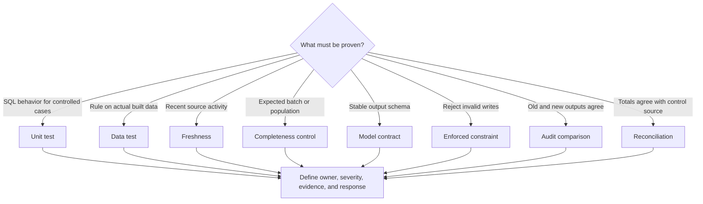

---
tags:
  - note-decision
---

# Decisions - Choosing the Right dbt Quality Control

> Choose the control from the question being asked: logic, real data, arrival, completeness, interface stability, write-time enforcement, cross-system agreement, and operational response are different risks.

## Decision Frame

Clients often ask for “more tests” when the real problem is that they have not identified what must be proven.

The first question should be:

> “What failure are we trying to detect or prevent, at what point in the lifecycle, and what must happen if it occurs?”

No single dbt feature proves every aspect of quality:

| Question | Primary control |
|---|---|
| Does the model SQL produce the expected result for designed cases? | Unit test |
| Does actual built data violate a technical or business rule? | Generic, singular, or custom data test |
| Did the source receive recent data? | Source freshness |
| Did the full expected batch or population arrive? | Completeness or batch-control test |
| Must the model publish an exact structural interface? | Enforced model contract |
| Must invalid data be rejected during a write? | Genuinely enforced warehouse or ingestion constraint |
| Do legacy and replacement outputs agree? | Audit comparison |
| Do amounts and populations agree with an authoritative source? | Reconciliation |
| Should a failure warn, block descendants, or prevent publication? | Severity plus orchestration and incident policy |
| Is quality degrading across runs? | Retained artifacts and observability |

## Recommendation Table

| Situation | Recommend | Why | Watch-outs |
|---|---|---|---|
| Complex `case`, join, date, boundary, or incremental SQL | Unit test with controlled fixtures | Proves designed behavior before full materialization | Does not inspect production data or production scale |
| Primary key, allowed value, relationship, or business rule in built data | Generic or singular data test | Executes the expectation against the actual relation | Detection occurs after the model is materialized |
| Reusable rule appears across many resources | Custom generic test | Standardizes the rule and arguments | Shared test code needs versioning, tests, and ownership |
| Source may be late | Freshness check against a trustworthy load signal | Separates pipeline success from current input | Recency does not prove completeness or validity |
| Scheduled file or batch may be partial | Expected-batch or population completeness control | Confirms everything expected arrived | Requires an authoritative expectation or manifest |
| Public model must not change shape accidentally | Enforced model contract | Protects names and data types relied on by consumers | Does not prove grain, values, or unchanged meaning |
| Invalid values must be stopped at write time | Enforced source, ingestion, or warehouse constraint | Prevention occurs closer to entry | Verify actual adapter and platform enforcement |
| Critical model is being refactored or migrated | Unit tests plus audit comparison and reconciliation | Protects designed logic and compares real outputs | Align source snapshots, keys, normalization, and materiality |
| Regulatory or material finance output | Layered control stack with blocking gate and retained evidence | No one test covers logic, population, totals, timing, and accountability | Define authoritative source, cutoff, owner, approval, and recovery |
| Quality issue is tolerated temporarily | Warning with owner, impact threshold, escalation, and expiry | Makes accepted risk explicit | Unowned warnings become permanent defects |
| Need long-term proof that controls operated | Archive artifacts, results, failures, incidents, and sign-offs externally | Local run state is not a durable evidence store | Govern access, retention, immutability, and sensitive records |
| Need data-health trends and alert routing | Observability around dbt and warehouse metadata | Adds cross-run monitoring and operational context | A vendor score is not a substitute for approved controls |

## Deciding Axes

- **Question type:** logic, structure, actual values, arrival, completeness, equivalence, totals, or operational health.
- **Input type:** controlled fixtures, current production data, authoritative control data, or old-versus-new populations.
- **Lifecycle point:** development, CI, write time, post-build validation, pre-publication, or continuous production monitoring.
- **Behavior:** prevent, detect, warn, block, quarantine, recover, or provide assurance.
- **Scope:** one column, one model, a full batch, a cross-system population, or a downstream exposure.
- **Materiality:** technical inconvenience, consumer degradation, financial misstatement, customer harm, or regulatory impact.
- **Evidence:** transient developer feedback, retained run artifact, diagnostic rows, issue record, or formal sign-off.
- **Cost:** fixture execution, table scan, large uniqueness aggregation, historical diff, evidence storage, and repeated retries.
- **Ownership:** developer, source owner, data owner, report owner, control owner, platform operations, or independent assurance.

## Consultant Recommendation Shape

> “Start with the risk question, then select the smallest control that actually answers it. For important outputs, combine complementary controls and define ownership, materiality, evidence, and failure response rather than treating a green dbt job as proof of quality.”

## Questions To Ask

- Are we proving SQL logic, actual data quality, source delivery, structural stability, or agreement with an authoritative source?
- Does the control need to prevent bad writes or detect them after materialization?
- What population, cutoff, grain, and business calendar define the scope?
- Which failures are warnings, build errors, publication blockers, or incidents?
- Who approves the rule and tolerance, who operates it, and who accepts exceptions?
- What evidence must remain available after the next dbt invocation?
- Does the control cover sensitive data, and how will diagnostic records be protected?
- What is the warehouse cost, and can the control be partitioned without weakening it?
- Which downstream exposures must be notified, withheld, replayed, or restated?

## Related Learning Topics

- [[02 dbt/03 Testing Documentation and Data Quality/21 Generic Singular and Custom Data Tests]]
- [[02 dbt/03 Testing Documentation and Data Quality/22 Unit Tests for SQL Logic]]
- [[02 dbt/03 Testing Documentation and Data Quality/23 Source Freshness and SLA Monitoring]]
- [[02 dbt/03 Testing Documentation and Data Quality/26 Model Contracts and Constraints]]
- [[02 dbt/03 Testing Documentation and Data Quality/27 Test Severity and Failure Handling]]
- [[02 dbt/03 Testing Documentation and Data Quality/28 Audit and Migration Validation]]
- [[02 dbt/03 Testing Documentation and Data Quality/29 Data Quality Strategy in Regulated Environments]]

## Related Comparisons and Scenarios

- [[80 Comparisons and Decision Notes/Comparisons/dbt/Comparison - Freshness vs Completeness vs Validity vs Reconciliation]]
- [[80 Comparisons and Decision Notes/Comparisons/dbt/Comparison - Model Contracts vs Data Tests vs Warehouse Constraints]]
- [[80 Comparisons and Decision Notes/Client Scenarios/dbt/Scenario - Dashboard Published From Stale Source Data]]
- [[80 Comparisons and Decision Notes/Client Scenarios/Snowflake/Scenario - Trade Batch Must Be Validated Before Publication]]

## Sources To Revisit

- [dbt Developer Hub - Data tests](https://docs.getdbt.com/docs/build/data-tests)
- [dbt Developer Hub - Unit tests](https://docs.getdbt.com/docs/build/unit-tests)
- [dbt Developer Hub - Source freshness](https://docs.getdbt.com/docs/deploy/source-freshness)
- [dbt Developer Hub - Model contracts](https://docs.getdbt.com/docs/mesh/govern/model-contracts)
- [dbt Developer Hub - Constraints](https://docs.getdbt.com/reference/resource-properties/constraints)
- [dbt Developer Hub - Test severity](https://docs.getdbt.com/reference/resource-configs/severity)
- [dbt Labs - dbt-audit-helper](https://github.com/dbt-labs/dbt-audit-helper)
