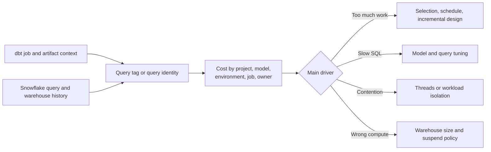

---
tags:
  - note-decision
---

# Decisions - Controlling and Attributing dbt Cost on Snowflake

> Attribute cost to a project, environment, job, and owner before tuning; then change selection, schedule, SQL, materialization, concurrency, or warehouse size based on evidence.

## Decision Frame

dbt does not create a separate class of Snowflake compute. It generates and submits SQL to warehouses. Cost problems therefore need both dbt context and Snowflake execution evidence.

The useful sequence is:

1. Identify which project, job, model, test, or operation caused the work.
2. Confirm which warehouse ran it and whether another control-plane warehouse also woke.
3. Separate frequency, concurrency, scan volume, spill, queueing, and inefficient model design.
4. Change the smallest relevant control and verify the outcome.

## Recommendation Table

| Situation | Recommend | Why | Watch-outs |
|---|---|---|---|
| Cost cannot be assigned to models or jobs | Standardize query tags and retain dbt artifacts | Creates actionable attribution | Tags must be consistent and protected from accidental overwrite |
| Frequent full refreshes dominate spend | Fix selection and incremental/backfill strategy | Avoids repeatedly rebuilding unchanged history | Preserve correction and replay controls |
| Tests consume material compute | Tier tests by risk and cadence | Keeps critical controls while reducing duplicate scans | Do not remove regulated reconciliations merely for cost |
| High thread count causes queueing or spill | Tune concurrency before blindly upsizing | More parallel SQL can reduce throughput | Measure warehouse load and critical path |
| One workload disrupts another | Isolate warehouses or schedules | Protects SLA and improves ownership | More warehouses can increase total active time |
| Native Snowflake task and dbt profile use different warehouses | Align them where appropriate | Avoids waking two warehouses for one run | Both role contexts still need intended privileges |
| Small warehouse runs much longer | Compare total credits and critical-path runtime | Larger can be cheaper if it finishes sufficiently faster | Many dbt jobs are not bottlenecked on size alone |
| Package adds metadata models or tests | Enable and schedule only needed resources | Package defaults can create hidden work | Recheck after upgrades |

## Cost Attribution Dimensions

- Project and Git revision.
- Environment and target.
- Job/run invocation.
- Model, test, snapshot, seed, hook, or operation.
- Warehouse and role.
- Domain, product owner, and cost center.
- Query duration, bytes scanned, spill, queueing, and credits over the run window.

## Questions To Ask

- Which run or change caused the increase?
- Can queries be tied back to dbt nodes and owners?
- Did schedule frequency, selection, tests, or full refresh behavior change?
- Is the warehouse busy, queued, spilling, or mostly idle?
- Are task and profile warehouses aligned for native dbt execution?
- What correctness or recovery capability would a cost optimization weaken?
- How will savings be measured after the change?

## Related Learning Topics

- [[02 dbt/08 dbt on Snowflake and Finance Patterns/77 Cost Governance for dbt on Snowflake]]
- [[02 dbt/04 Incremental Processing and Performance/37 Threads Warehouse Sizing and Snowflake Cost]]
- [[02 dbt/04 Incremental Processing and Performance/38 Query Tuning Feedback Loop]]
- [[02 dbt/05 Deployment CI CD and Operations/45 Artifacts Logs and Run Results]]
- [[02 dbt/07 Packages Macros and Advanced Reuse/64 Snowflake and Operations Packages]]
- [[01 Snowflake/06 Cost Management and Operations/44 Credit Consumption Model]]

## Related Comparisons and Scenarios

- [[80 Comparisons and Decision Notes/Decision Notes/Snowflake/Decisions - Diagnosing Snowflake Spend Increases]]
- [[80 Comparisons and Decision Notes/Decision Notes/dbt/Decisions - Choosing a dbt Incremental Strategy on Snowflake]]
- [[80 Comparisons and Decision Notes/Comparisons/Snowflake/Comparison - Virtual Warehouse Size vs Multi-cluster]]

## Sources To Revisit

- [Snowflake Documentation - Understanding costs for dbt Projects on Snowflake](https://docs.snowflake.com/en/user-guide/data-engineering/dbt-projects-on-snowflake-cost)
- [Snowflake Documentation - Best practices for dbt Projects on Snowflake](https://docs.snowflake.com/en/user-guide/data-engineering/dbt-projects-on-snowflake-best-practices)
- [dbt Developer Hub - Snowflake query tags](https://docs.getdbt.com/reference/resource-configs/snowflake-configs#query-tags)
