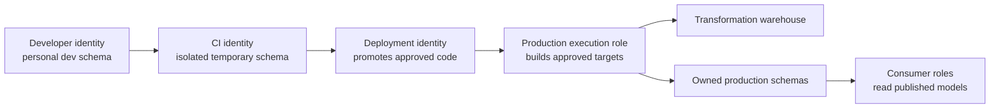

---
tags:
  - note-decision
---

# Decisions - Designing dbt Roles Schemas and Warehouses on Snowflake

> Separate development, deployment, and production execution identities; isolate schemas by environment and ownership; isolate warehouses by workload only where the operating benefit justifies it.

## Decision Frame

A dbt target combines an identity, role, warehouse, database, and schema. Treating that profile as a convenience string leads to accidental production access, ambiguous ownership, and poor cost attribution.

The design must answer three connected questions:

1. **Who may change or execute the project?**
2. **Where may each environment create objects?**
3. **Which compute should the workload wake and pay for?**

## Recommendation Table

| Situation | Recommend | Why | Watch-outs |
|---|---|---|---|
| Developer work | Personal or branch-isolated schema with non-production role | Prevents collisions and unsafe writes | Limit sensitive production reads |
| Pull-request CI | Dedicated CI identity and disposable schema | Makes validation reproducible and attributable | Cleanup, naming, and clone cost |
| Production scheduling | Non-human production execution identity | Stable ownership and auditable least privilege | Rotation, keyless authentication, incident access |
| Deployment and execution require different powers | Separate deployer from runtime role | Deployment can change code without broad data privileges | Document handoff and rollback |
| Several domains publish independently | Domain-owned schemas and roles | Clear ownership and blast radius | Shared conformed data needs explicit grants |
| Workloads contend or need cost attribution | Separate warehouses by workload or domain | Isolation and chargeback improve | More warehouses can increase idle/start overhead |
| Small predictable estate | One well-governed transform warehouse | Simpler operations | Monitor queueing before splitting |
| dbt Projects on Snowflake | Validate calling role, profile role, and warehouse alignment | Effective execution depends on both role contexts | Mismatched task/profile warehouses can wake two warehouses |

## Control Boundaries

| Boundary | Recommended owner |
|---|---|
| Project deployment privilege | CI/CD or platform deployment role |
| Source read and target write privileges | Production dbt execution role |
| Published-model read privileges | Consumer roles, not the build role |
| Developer schemas | Individual or branch ownership with cleanup policy |
| Production schemas | Domain or platform-managed ownership role |
| Warehouse sizing and resource controls | Platform owner with workload owner input |

## Questions To Ask

- Which identities develop, validate, deploy, schedule, and execute?
- Can one role both alter project code and access sensitive production data?
- How are CI schemas named, isolated, and removed?
- Which team owns each production schema and published interface?
- Is warehouse separation solving contention, security, SLA, or chargeback?
- For native dbt Projects, are calling and profile roles intentionally aligned?
- Can the task and profile accidentally wake different warehouses?

## Related Learning Topics

- [[02 dbt/08 dbt on Snowflake and Finance Patterns/73 dbt on Snowflake Operating Model]]
- [[02 dbt/08 dbt on Snowflake and Finance Patterns/75 Snowflake RBAC for dbt]]
- [[02 dbt/08 dbt on Snowflake and Finance Patterns/76 Database Schema and Warehouse Strategy]]
- [[02 dbt/05 Deployment CI CD and Operations/41 Dev CI Staging and Prod Environments]]
- [[02 dbt/05 Deployment CI CD and Operations/47 Secrets Service Accounts and RBAC]]
- [[01 Snowflake/03 Security and Governance/12 RBAC Roles and Privileges]]

## Related Comparisons and Scenarios

- [[80 Comparisons and Decision Notes/Decision Notes/dbt/Decisions - Choosing a dbt Environment and Credential Strategy]]
- [[80 Comparisons and Decision Notes/Comparisons/Cross-Tool/Comparison - dbt Projects on Snowflake vs dbt Platform]]
- [[80 Comparisons and Decision Notes/Client Scenarios/dbt/Scenario - Analyst Accidentally Ran dbt Against Production]]

## Sources To Revisit

- [Snowflake Documentation - Best practices for dbt Projects on Snowflake](https://docs.snowflake.com/en/user-guide/data-engineering/dbt-projects-on-snowflake-best-practices)
- [Snowflake Documentation - Access control for dbt Projects](https://docs.snowflake.com/en/user-guide/data-engineering/dbt-projects-on-snowflake-access-control)
- [dbt Developer Hub - Snowflake profile](https://docs.getdbt.com/docs/core/connect-data-platform/snowflake-setup)
