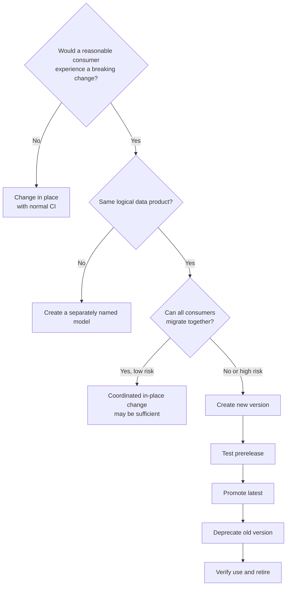

---
tags:
  - note-decision
---

# Decisions - Versioning and Deprecating a dbt Model

> Version a mature shared interface when consumers need a migration window; otherwise prefer the smallest coordinated change that preserves clear product meaning.

## Decision Frame

Clients usually ask, **"Do we need a new model version for this change?"**

The decision depends on more than whether columns change:

- Is the model a stable public interface or a private implementation detail?
- Can all known consumers migrate in the same release?
- Does the schema, grain, identifier, constraint, or business meaning change?
- Is the proposed implementation still the same logical data product?
- What does it cost to build, test, support, and eventually retire two versions?
- Are material reports, applications, data shares, or regulatory processes involved?

The principle is: **version the consumer promise, not every code edit.**

## Recommendation Table

| Situation | Recommend | Why | Watch-outs |
|---|---|---|---|
| Private model with fully controlled descendants | Change in place and rebuild affected DAG | Avoids unnecessary interface ceremony | Check for unmanaged direct queries |
| Additive optional column | Usually change in place | Normally preserves existing consumers | `select *`, extracts, and strict external schemas |
| Remove/rename column or change data type | New version for shared model | Preserves old structural promise | Parallel build and migration cost |
| Change grain or primary identifier | New version or separately named model | Consumer assumptions can fail silently | Decide whether product identity changed |
| Major calculation or regulatory methodology change | New version with approval and reconciliation | Meaning can break while schema remains identical | Effective date and restatement policy |
| New concept rather than new interface | Separate model | Keeps discovery and semantics honest | Avoid duplicate or ambiguous names |
| Small team can migrate every consumer at once | Coordinated in-place breaking change may be acceptable | Version overhead may not add value | Document decision and confirm external use |
| Public or cross-project Mesh model | Contracted version with migration window | Treats model as a managed API | Producer-consumer coordination |
| Critical consumer cannot accept automatic promotion | Pin to explicit version temporarily | Consumer controls change timing | Pin needs owner and expiry |
| Low-risk consumer accepts producer release cadence | Unpinned reference | Reduces long-lived pinning debt | Latest promotion must be predictable |
| Old interface can be reproduced from new output | Compatibility view | Reduces duplicate compute and storage | Must preserve meaning and performance |
| Old interface needs different logic | Independent version build | Keeps behavior truthful | Duplicate cost, controls, and incident scope |
| Deprecation deadline reached | Verify usage, remove code, explicitly drop relation | Completes retirement and stops cost | dbt does not clean warehouse objects automatically |
| Financial history is affected | Pair model version with restatement/backfill decision | Versioning and historical correction solve different problems | Cutoff, audit, republication, approvals |

## Deciding Axes

- **Interface maturity:** experimental, internal, stable mart, public model, or cross-project data product.
- **Breaking dimension:** schema, data type, grain, key, constraint, semantics, access, or physical relation.
- **Consumer control:** one team, several dbt projects, BI, applications, files, external shares, or unknown direct SQL.
- **Coordination ability:** same-release migration versus independent consumer timelines.
- **Product identity:** evolution of the same product versus a genuinely different concept.
- **Materiality:** dashboard inconvenience, operational decision, customer impact, financial statement, or regulatory submission.
- **Parallel-run cost:** compute, storage, tests, support, documentation, monitoring, and reconciliation.
- **Migration control:** pinned versus unpinned references, latest promotion, deadline, warnings, and exceptions.
- **Retirement evidence:** lineage, query/access history, catalog, owner confirmation, and cleanup record.
- **Historical treatment:** prospective change, backfill, restatement, or dual methodology by effective date.

## Consultant Recommendation Shape

> "Treat this model as an API only if it has real consumers. If the same product needs a breaking change and consumers cannot migrate together, introduce a contracted prerelease version, validate it, promote it deliberately, deprecate the old version with a finite window, and verify all dbt and non-dbt use before cleanup."

## Questions To Ask

- Which consumer promise is changing?
- Is the model public, contracted, or externally queried?
- Would a reasonable consumer regard the behavior change as breaking?
- Is it still the same logical data product?
- Can every consumer migrate in one release?
- Who owns each pinned or direct dependency?
- What reconciliation and approval make v2 fit to become latest?
- What is the deprecation date, timezone, and exception process?
- Can v1 be a truthful compatibility view?
- What Snowflake and BI metadata prove v1 is no longer used?
- Does retirement require a historical restatement or downstream republication?
- Who explicitly approves removal and relation cleanup?

## Related Learning Topics

- [[02 dbt/06 Governance Semantic Layer and Mesh/50 Groups and Ownership]]
- [[02 dbt/06 Governance Semantic Layer and Mesh/51 Model Access]]
- [[02 dbt/06 Governance Semantic Layer and Mesh/52 Model Contracts]]
- [[02 dbt/06 Governance Semantic Layer and Mesh/53 Model Versions and Deprecation]]
- [[02 dbt/06 Governance Semantic Layer and Mesh/54 dbt Mesh and Project Dependencies]]
- [[02 dbt/06 Governance Semantic Layer and Mesh/57 Metadata Lineage and Catalog Strategy]]
- [[02 dbt/04 Incremental Processing and Performance/39 Full Refreshes Backfills and Replay]]

## Related Comparisons and Scenarios

- [[80 Comparisons and Decision Notes/Decision Notes/dbt/Decisions - Choosing a Data History and Restatement Pattern]]
- [[80 Comparisons and Decision Notes/Decision Notes/dbt/Decisions - Choosing the Right dbt Quality Control]]
- [[80 Comparisons and Decision Notes/Client Scenarios/dbt/Scenario - Team Cannot Tell Which Dashboards a Model Change Will Break]]

## Sources To Revisit

- [dbt Developer Hub - Model versions](https://docs.getdbt.com/docs/mesh/govern/model-versions)
- [dbt Developer Hub - versions property](https://docs.getdbt.com/reference/resource-properties/versions)
- [dbt Developer Hub - latest_version property](https://docs.getdbt.com/reference/resource-properties/latest_version)
- [dbt Developer Hub - deprecation_date property](https://docs.getdbt.com/reference/resource-properties/deprecation_date)
