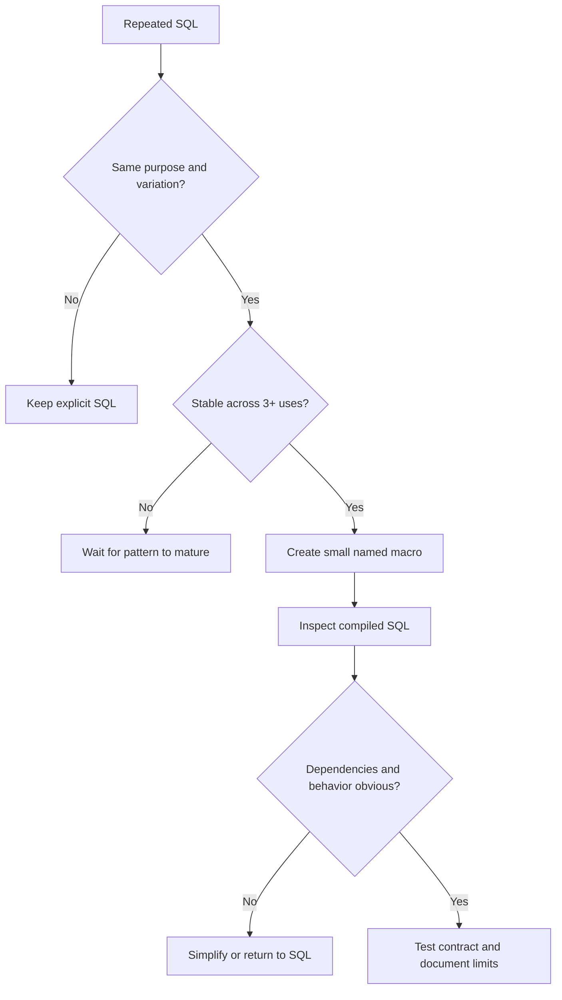

---
tags:
  - note-decision
---

# Decisions - When to Abstract dbt SQL into Macros

> Abstract stable mechanical repetition; keep business meaning, data grain, and model dependencies visible.

## Decision Frame

Short source code is not automatically simple code. A macro can remove duplication while making compiled SQL, dependencies, performance, and debugging harder to see.

The useful question is: **Does the abstraction create a stable reusable contract, or does it merely hide SQL that reviewers need to understand?**

## Recommendation Table

| Situation | Recommend | Why | Watch-outs |
|---|---|---|---|
| Repeated identifier quoting or standard expression | Small macro | Stable mechanical reuse | Keep output type and adapter behavior clear |
| Repeated business calculation with subtle exceptions | Usually explicit model SQL | Reviewers need to see meaning and variation | Centralize only after the rule is truly shared |
| Many similar columns generated from a controlled list | Jinja loop or focused macro | Reduces copy-paste errors | Review the expanded SQL and column names |
| Warehouse-specific syntax behind a common interface | Adapter dispatch | Localizes platform variation | Define default behavior and test each supported adapter |
| Macro queries warehouse metadata during compilation | Use sparingly | Can automate real metadata-driven work | Connection, latency, determinism, and command context |
| Macro emits hidden `ref()` or dynamic relation names | Redesign toward explicit dependencies | DAG clarity is more valuable than short source | Use explicit inputs or dependency hints only when unavoidable |
| One-off SQL used once | Leave as SQL | Lowest cognitive overhead | A little duplication can be cheaper than abstraction |
| Generated SQL is hard to review or tune | Split into models or simplify macro | Restores observability and ownership | Do not optimize only for source-file length |

## Abstraction Test

A production macro should have:

- A name that describes purpose rather than implementation trick.
- A small input and output contract.
- Deterministic behavior for a pinned runtime.
- Visible relation dependencies where practical.
- Readable compiled SQL.
- Tests for important branches and failure cases.
- An owner and documented boundary for unsupported use.

If several items are missing, explicit SQL is usually the safer choice.

## Questions To Ask

- How many genuine uses exist today?
- Are the uses semantically identical or merely syntactically similar?
- Can a reviewer predict the compiled SQL quickly?
- Are `ref()` and `source()` dependencies still visible to dbt?
- Does the macro perform warehouse queries or side effects?
- Which adapter and runtime branches require testing?
- Would another intermediate model express the logic more clearly?

## Related Learning Topics

- [[02 dbt/07 Packages Macros and Advanced Reuse/67 Jinja Fundamentals]]
- [[02 dbt/07 Packages Macros and Advanced Reuse/68 Macros as Reusable SQL Functions]]
- [[02 dbt/07 Packages Macros and Advanced Reuse/70 Adapter Dispatch]]
- [[02 dbt/07 Packages Macros and Advanced Reuse/72 Advanced Macro Boundaries]]
- [[02 dbt/02 Modeling Patterns and Layering/12 Intermediate Models]]

## Related Comparisons and Scenarios

- [[80 Comparisons and Decision Notes/Comparisons/dbt/Comparison - Hooks vs Models Tests and Operations]]
- [[80 Comparisons and Decision Notes/Decision Notes/dbt/Decisions - Choosing the Right dbt Modeling Layer]]

## Sources To Revisit

- [dbt Developer Hub - Jinja and macros](https://docs.getdbt.com/docs/build/jinja-macros)
- [dbt Developer Hub - dispatch](https://docs.getdbt.com/reference/dbt-jinja-functions/dispatch)
- [dbt Developer Hub - ref](https://docs.getdbt.com/reference/dbt-jinja-functions/ref)
