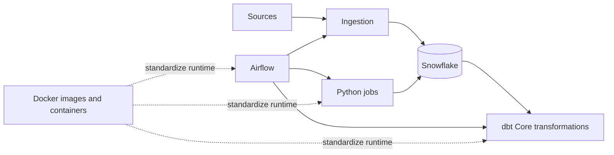

# Modern Data Stack Overview

## Short Version

- **Fivetran** usually handles extraction and loading from source systems.
- **Snowflake** usually handles storage, compute, governance, and analytical querying.
- **dbt** usually handles SQL-based transformations, testing, documentation, and analytics engineering workflow.
- **Airflow** usually coordinates when and in what order data jobs run.
- **Python** usually handles custom processing, automation, APIs, and utilities that do not fit cleanly in SQL.
- **Docker** packages and runs the software environment used by dbt Core, Airflow, and Python; Snowflake normally remains an external managed service.

## Consultant Frame

A useful client discussion usually separates these questions:

- Where does the data come from?
- Where should the data live?
- Where should transformations happen?
- Who owns quality, documentation, and governance?
- How will cost, access, and operations be controlled?
- Which runtime dependencies should be standardized in container images, and which configuration or credentials must stay external?

## Runtime View

## Related Reasoning Notes

- [[80 Comparisons and Decision Notes/Comparisons and Decision Notes Overview]]
- [[04 Docker/Docker Learning Map|Docker Learning Map]]
