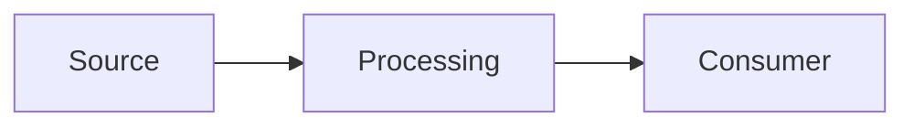

# Architecture Decision - Decision Title

> Record a generalized architectural decision, why it was made, and which conditions would cause it to be revisited.

> [!note] Working-output template
> Use this to structure a chat response or draft. Do not save it as durable precedent unless explicitly asked; reusable cross-client guidance should normally be distilled into a `Decisions - <topic>` note.

> [!caution] Context-bound decision
> This record is reusable only where its assumptions and constraints also hold. Verify current product facts and do not treat it as universal precedent.

## Decision Status

- **Status:** Proposed / Accepted / Superseded / Rejected
- **Decision owner role or team archetype:**
- **Decision date:**
- **Review trigger or date:**

## Situation and Goal

- **Problem:**
- **Desired outcome:**
- **Current state:**
- **Scope:**
- **Non-scope:**

## Requirements and Decision Drivers

| Requirement or driver | Priority | How it affects the decision |
|---|---|---|
|  |  |  |

## Assumptions and Unknowns

- **Assumptions:**
- **Material unknowns:**
- **Decisions requiring external approval:**

## Options Considered

| Option | Benefits | Costs and risks | Conditions that favor it |
|---|---|---|---|
|  |  |  |  |

## Decision

- **Selected option:**
- **Why:**
- **Why the alternatives were not selected:**

## Architecture Sketch

## Consequences and Trade-offs

- **Positive consequences:**
- **Negative consequences:**
- **Security and governance:**
- **Reliability and recovery:**
- **Performance and scale:**
- **Cost:**
- **Operations and ownership:**

## Validation and Evidence

| Material claim or assumption | Evidence or test | Result and confidence |
|---|---|---|
|  |  |  |

## What Would Change This Decision

- List thresholds, requirement changes, product changes, or failed assumptions that should trigger review.

## Implementation and Rollback

- **Implementation outline:**
- **Migration or rollout:**
- **Rollback or exit path:**
- **Observability:**

## Related Learning and Reasoning Notes

-

## Sources To Revisit

- Prefer current official and primary sources for material claims.
