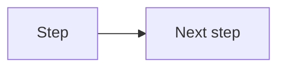

# Topic Title

> One-sentence subtitle: what this topic does and why a consultant should care.

## Executive Summary

- **What it is:** 
- **Why it matters:** 
- **Mental model:** 
- **Best used when:** 
- **Avoid or reconsider when:** 

## What It Can Do

- 

## What It Cannot Do

- 

## Core Concepts

| Concept | Meaning | Why it matters |
|---|---|---|
|  |  |  |

## How It Works (Simple Flow)

Use a simple numbered flow (usually 4-8 steps) showing the mechanism end-to-end at consultant depth.

## Visuals

- Add **one Mermaid diagram by default** when relevant and possible (flows, lifecycles, decision paths, dependency maps); skip only when no useful visual exists.
- Use an embedded local image only when a polished vendor diagram or screenshot is clearly stronger than Mermaid.
- If skipped, add one sentence: `No high-value visual identified for this topic yet.`
- Prioritize official visuals from Snowflake/dbt/Fivetran; otherwise use reputable sources.
- Keep the source URL in `Sources To Revisit` when using an external image.



For the image exception, embed from the assets folder instead:

```md
![[00 Home/assets/<image-file>.png]]
```

## Readable Snippets

```sql
-- Add small examples here when useful.
```

## Consultant Talking Points

- **Client question this answers:** 
- **Trade-offs to mention:** 
- **Risk or governance angle:** 
- **Cost/performance angle:** 

## Common Pitfalls

- Add at least 3 practical pitfalls linked to cost, performance, governance, or operations.

## When to Recommend What (Decision Table)

| Situation | Recommend | Why | Watch-outs |
|---|---|---|---|
|  |  |  |  |

## Related Topics

- 

## Related Decision Notes

- Add 1-3 curated links to comparison or decision notes when useful.
- Prefer letting scenario notes link to topic notes; backlinks will show scenarios without cluttering topic notes.
- Skip this section only when no useful decision note exists yet.

## Questions

- 

## Sources To Revisit

- 
