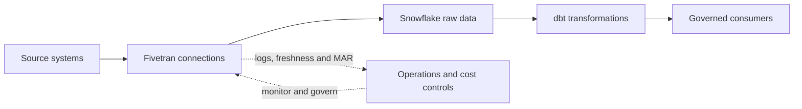

# Fivetran Topics 01-32 - Quick Teaching Summary

> A compact teaching pass through Fivetran architecture, connectors, sync behavior, destination semantics, Snowflake and dbt integration, production controls, and cost decisions.



## Chapter 1 - Foundations and Platform Mental Model

### 01 - What Fivetran Is and Is Not

- Fivetran is a managed ELT service that extracts data from supported sources and loads source-shaped data into a destination such as Snowflake.
- It removes much of the repetitive work involved in maintaining API clients, database replication logic, schedules, retries, and schema adaptation.
- It is not the data warehouse, and it does not replace dbt's responsibility for business transformations, tests, documentation, and curated analytical models.
- Recommend it when connector coverage, latency, security, recovery, and commercial terms meet the requirement and the client values low maintenance over total implementation control.
- The client still owns data approval, least-privilege access, destination security, reconciliation, monitoring, incident response, and the business meaning of the data.

### 02 - Platform Anatomy and End-to-End Data Flow

- A **connector** is Fivetran's reusable integration for a source type, while a **connection** is one configured pipeline from a particular source instance to a destination.
- An account contains destinations or groups, and each destination can contain several independently scheduled and monitored connections.
- Data flows from the source through a connection into connector-managed schemas and tables in the destination.
- This hierarchy matters because access, usage, failures, naming, and ownership are usually assigned at account, destination, or connection level.
- Design the hierarchy around security and operating boundaries, and avoid duplicating the same source into multiple connections unless environment or regulatory isolation genuinely requires it.

### 03 - The Connection Lifecycle

- A production connection moves through assessment, authorization, setup testing, initial sync, incremental operation, maintenance, recovery, and eventual retirement.
- The initial sync establishes the historical baseline, while later syncs use connector-specific state or source change mechanisms to keep the destination current.
- Most long-term risk appears after setup through expired credentials, source API changes, lost log retention, schema drift, delayed syncs, or unclear ownership.
- Recovery can involve retrying, resuming, repairing source prerequisites, or re-syncing at the narrowest safe scope, followed by reconciliation.
- Decommissioning must remove schedules, credentials, downstream dependencies, obsolete raw data, and monitoring without destroying evidence that retention policy still requires.

### 04 - Connections, Transformations, and Activations

- **Connections** move data inbound from operational sources into a warehouse, database, or lake.
- **Transformations** run or trigger post-load modeling in the destination, including Fivetran-hosted dbt Core and supported third-party orchestration.
- **Activations** perform reverse ETL by sending approved warehouse data back into operational applications.
- These surfaces have different directions, credentials, owners, failure consequences, and pricing units, so they should not be governed as one indistinguishable pipeline.
- Use only the surfaces that improve the client's operating model, especially when an existing dbt or reverse-ETL platform already meets the need.

### 05 - When to Recommend Fivetran

- A sound recommendation evaluates six gates: source coverage, data behavior, latency, security, operating model, and economics.
- The presence of a connector logo does not prove that required objects, fields, keys, deletes, history, quotas, or recovery behavior are supported.
- Fivetran is strongest for conventional analytical ingestion where managed maintenance creates more value than bespoke pipeline control.
- Reconsider it when critical requirements need unsupported data, hard real-time behavior, complex pre-load processing, unusual recovery guarantees, or an unacceptable vendor boundary.
- Use a representative pilot to prove difficult assumptions and measure correctness, freshness, source impact, MAR, Snowflake cost, and operator effort before making a broad commitment.

## Chapter 2 - Connectors and Sync Behavior

### 06 - Connector Types, Coverage, and Maturity

- Connector types include standard Fivetran-built connectors, narrower Lite connectors, customer-built Connector SDK connections, and source categories such as applications, databases, files, and events.
- Maturity labels such as Private Preview, Beta, and Generally Available describe release confidence and support expectations, not client-specific suitability.
- Evaluate the exact connector documentation for tables, fields, history, deletes, primary keys, sync modes, filters, networking, plan gates, and known limitations.
- A GA connector can still fail a material use case, while a narrower connector can be acceptable if its supported scope exactly matches the requirement.
- Approve production use only after a pilot covers normal changes, difficult edge cases, recovery, schema evolution, and reconciliation.

### 07 - Application and API Connectors

- Application connectors periodically call a vendor API, normalize its objects into destination tables, and retain state for later incremental requests.
- The source API ultimately controls which objects and history are available, how quickly changes appear, and whether deletes can be observed reliably.
- Rate limits, pagination, delayed reports, mutable reporting windows, authentication scopes, and custom fields can all change freshness and completeness.
- These connectors are usually eventually consistent analytical feeds rather than transactionally consistent or real-time integrations.
- Recommend them when the required data is exposed and quotas support the service level, but validate the destination against source totals and business timestamps.

### 08 - Database Connectors, CDC, and High-Volume Agent

- A database connection normally performs an initial copy and then captures later changes through transaction logs, native change tracking, or another supported incremental method.
- The memorable model is to copy the current book once and then follow its change journal rather than repeatedly scanning the whole database.
- Source permissions, log configuration, log retention, network access, supported keys, and outage duration determine whether CDC remains recoverable.
- High-Volume Agent is an agent-based pattern for supported enterprise databases where higher scale or particular source requirements justify additional local infrastructure.
- Recommend database replication only after measuring source impact and proving that latency, deletes, schema changes, long outages, and re-sync requirements are supportable.

### 09 - File, Event, and Custom Connector Patterns

- File connectors discover batches in storage locations, so stable names, delivery completion, schemas, replacement behavior, and retention determine reliability.
- Event connectors accept pushed records and are naturally suited to append-oriented data, but producers must still handle unique identity, delivery, ordering, and replay.
- Connector SDK lets the client write Python extraction logic for an unsupported API while Fivetran hosts the runtime and handles destination loading.
- Custom extraction restores flexibility but also restores responsibility for code, state, keys, tests, upgrades, schema behavior, and incident support.
- Choose the pattern that matches how the source naturally publishes data instead of forcing batch files, events, or custom code into the same operational model.

### 10 - Initial, Incremental, Re-import, and Re-sync Strategies

- An initial sync creates the first destination baseline, and an incremental sync normally processes only changes since a retained cursor or checkpoint.
- Some tables must be re-imported in full because the source does not expose reliable increments, although Fivetran can still compare rows to identify actual changes.
- Rollback strategies revisit a recent source window because APIs may revise previously published data after the first extraction.
- A re-sync deliberately rebuilds a table or connection and should be treated as a recovery operation with source, destination, downstream, and cost impacts.
- Document the strategy per important table because extraction behavior determines delivery order, recovery options, history, source load, and destination disruption.

### 11 - Scheduling, Latency, Checkpoints, and Recovery

- Sync frequency is the requested cadence, while actual freshness also includes source availability, schedule waiting, sync duration, downstream transformation, validation, and consumer refresh.
- A connection scheduled every fifteen minutes can therefore deliver business-ready data much later than fifteen minutes.
- Checkpoints let a failed sync resume near its last safe progress point, but they do not prove that every expected business record arrived.
- Recovery is limited by the source's available history, API window, or database log retention, so an outage can eventually force a re-sync.
- Set end-to-end freshness objectives and monitor actual landing and publication timestamps rather than treating schedule configuration as an SLA.

## Chapter 3 - Destination Data, History, and Schema Change

### 12 - Soft Delete Mode vs History Mode

- Soft delete mode maintains one destination row per source key and marks detected source deletions with `_fivetran_deleted` instead of physically removing the row.
- History mode keeps multiple observed versions of a source row and uses validity metadata to distinguish current and prior versions.
- Soft delete is the simpler default for current-state raw data, while history mode is justified when past source values have durable analytical or audit value.
- History mode increases row volume, query complexity, MAR, and storage, and it cannot reconstruct changes that Fivetran never observed.
- Treat any mode change as a data-contract migration because table grain, system columns, and downstream query logic change.

```sql
-- Current rows in soft delete mode
where not coalesce(_fivetran_deleted, false)

-- Current rows in history mode
where _fivetran_active
```

### 13 - Keys, Deletes, and Fivetran System Columns

- A stable primary key tells Fivetran which destination row represents a particular source record and is essential for correct updates and deletes.
- If the source lacks a key, Fivetran may use a synthetic identity whose behavior can change when participating columns or source schemas change.
- `_fivetran_synced` describes Fivetran processing time, `_fivetran_deleted` marks detected deletes in relevant tables, and history tables add version-validity metadata.
- These columns describe ingestion behavior rather than business truth, so `_fivetran_synced` alone is not a sufficient business-freshness control.
- Establish key and delete semantics for every material table before downstream modeling to avoid duplicate facts, resurrected records, and misleading reconciliations.

### 14 - Destination Schemas, Naming, and Data Type Mapping

- Fivetran creates destination schemas and tables based on the connection, source structure, naming choice, and destination capabilities.
- Fivetran naming produces consistent normalized identifiers, while source naming preserves more original names but can introduce case sensitivity or collisions.
- Source data types pass through Fivetran's intermediate representation and are then mapped to Snowflake-compatible types, so the destination is not always type-identical to the source.
- Decide schema prefixes and naming before the initial sync because later changes can be disruptive or unsupported.
- Hide raw naming and type quirks behind stable dbt staging models, and test precision, timestamps, semi-structured values, and unsupported source types explicitly.

### 15 - Schema Change Handling and Data Selection Controls

- Schema change handling determines whether newly discovered schemas, tables, and columns are automatically allowed, partly allowed, or blocked.
- Table and column selection reduce unnecessary ingestion, while supported row filters narrow qualifying records and hashing changes sensitive values before destination use.
- Automatic discovery speeds onboarding but can also expose sensitive fields, increase MAR, and break downstream models when upstream systems evolve.
- Start from approved data scope and choose the least permissive change policy that still fits the client's operating model.
- Monitor detected changes and require an owner to assess downstream contracts, privacy, cost, and reconciliation before new data becomes trusted.

### 16 - Data Contracts, Completeness, and Reconciliation

- A successful Fivetran sync proves technical execution, not that all expected records arrived or that financial and business meaning is correct.
- A data contract defines expected fields, types, keys, grain, nullability, freshness, and change expectations at an agreed boundary.
- Completeness controls compare expected and received populations, while reconciliation compares authoritative counts, sums, balances, or control totals.
- Fivetran should expose source-shaped raw data, dbt should test and transform it, and a business owner should approve material results.
- For critical datasets, retain source evidence, sync evidence, dbt results, reconciliation outcomes, exceptions, and sign-off as one end-to-end control chain.

## Chapter 4 - Fivetran with Snowflake and dbt

### 17 - Setting Up Snowflake as a Destination

- Fivetran needs a dedicated Snowflake service identity, a purpose-built role, a landing database, and a warehouse capable of creating and updating destination objects.
- Key-pair authentication is the preferred machine-authentication pattern because it avoids durable password-based service access and supports controlled rotation.
- Grant only the documented database and warehouse capabilities, and never give the runtime identity broad administrative roles such as `ACCOUNTADMIN`.
- Choose and test the approved direct or private network path before enabling production connections.
- Run setup tests and a controlled sync, then verify object ownership, query history, cost attribution, downstream visibility, and key-rotation recovery.

```sql
create user FIVETRAN_USER
  type = service
  default_role = FIVETRAN_ROLE
  default_warehouse = FIVETRAN_WH;

grant usage on warehouse FIVETRAN_WH to role FIVETRAN_ROLE;
grant usage, monitor, create schema on database RAW to role FIVETRAN_ROLE;
```

### 18 - Snowflake Database, Schema, Warehouse, and Cost Design

- A common design gives Fivetran a clearly named raw database, connector-managed schemas, and a warehouse separate from dbt transformation compute.
- Separation makes access, incidents, workload contention, and cost attribution easier to understand, although a small pilot can share compute if risks are controlled.
- Frequent small syncs can repeatedly resume a warehouse, so cadence and auto-suspend behavior matter alongside warehouse size.
- Transient raw tables can reduce Fail-safe storage but weaken recovery, so use them only when the source can be reliably reconstructed and policy permits it.
- Keep Fivetran ownership over raw writes, give dbt its own transformation role and schemas, and expose only approved outputs to consumers.

### 19 - Fivetran to Snowflake to dbt Ownership Boundaries

- Fivetran owns managed extraction and loading, Snowflake owns storage, compute, and enforceable access, and dbt owns analytical transformation and project-level quality workflow.
- The source team still owns source availability and meaning, while business owners approve critical definitions, tolerances, and published results.
- Fivetran should not become the home for complex business logic, and dbt should not be expected to repair missing or unobservable source data.
- Define observable handoffs for source availability, raw landing, staging acceptance, model completion, reconciliation, and publication.
- A production operating model needs named owners and escalation paths at every boundary so an incident does not bounce indefinitely between tools and teams.

### 20 - Transformation and Orchestration Options

- Fivetran can provide Quickstart models, host dbt Core, trigger dbt Platform jobs, or participate in a workflow owned by an external orchestrator.
- Fivetran-hosted execution minimizes orchestration infrastructure, while dbt Platform provides a fuller dbt operating experience and external orchestration handles broader dependencies.
- Integrated scheduling can start transformations after selected syncs, but a long transformation can delay later connection activity in a sequential pipeline.
- Regardless of who triggers the work, Snowflake executes the SQL and the data team remains responsible for model logic, tests, environments, artifacts, and publication controls.
- Use the simplest option that satisfies dependency, CI/CD, audit, recovery, and observability requirements without creating duplicate or overlapping schedules.

### 21 - Finance and Banking End-to-End Case Study

- A regulated design might ingest core transactions, customer data, and exchange rates into isolated Snowflake raw schemas before dbt builds reconciled finance outputs.
- Each source needs approved data scope, a dedicated identity, a documented cutoff, stable keys, and authoritative control totals.
- dbt staging models normalize source conventions, while curated models apply governed business rules such as currency conversion, posting status, and business date.
- Publication should wait for freshness, uniqueness, completeness, balance, and cross-source reconciliation controls to pass and for material exceptions to be owned.
- Retain source evidence, Fivetran events, Snowflake query history, dbt artifacts, reconciliation results, approvals, and incident records so the pipeline is explainable after the fact.

## Chapter 5 - Security, Governance, and Production Operations

### 22 - Security Architecture and Shared Responsibility

- Fivetran secures and operates the managed data-movement service, but the client decides which data may move and who may access both endpoints.
- The client owns source and destination identities, least privilege, data classification, minimization, retention, monitoring, downstream policies, and business validation.
- Fivetran contributes encrypted transport, credential protection, connector maintenance, platform access controls, logs, and deployment options.
- Vendor certifications support due diligence but do not prove that a particular client workload is compliant or correctly governed.
- Before go-live, name owners for data approval, source access, destination access, Fivetran administration, monitoring, reconciliation, and incident escalation.

### 23 - SaaS, Hybrid, and Private Connectivity Patterns

- In SaaS Deployment, Fivetran processes data in its managed cloud, while Hybrid Deployment processes supported data flows inside the client's environment.
- Hybrid still relies on the Fivetran SaaS control plane for configuration and orchestration, so it is not equivalent to a completely disconnected self-hosted product.
- After choosing the processing boundary, choose a supported network path such as direct TLS, SSH tunnel, proxy, VPN, or cloud-private endpoint.
- Hybrid and advanced private-networking options add plan, infrastructure, capacity, upgrade, monitoring, failover, and support responsibilities.
- Trace the actual data, staging, metadata, DNS, routing, and support paths instead of assuming that words such as encrypted, private, or local automatically satisfy policy.

### 24 - Credentials, RBAC, SSO, SCIM, and Service Access

- SSO authenticates human users, SCIM manages their joiner-mover-leaver lifecycle, RBAC authorizes actions, and API keys identify automation.
- Fivetran permissions can apply at account, destination, and connection levels, with higher-level rights cascading to lower resources.
- Use dedicated source and destination service identities rather than shared administrators or personal accounts.
- Durable automation should use governed, narrowly scoped credentials with secret storage, rotation, revocation, ownership, and audit logging.
- Regularly review effective access because team membership, inherited roles, contractors, API keys, and emergency changes can expand permissions over time.

### 25 - Privacy, Compliance, Audit, and Vendor Risk

- Fivetran sits between sensitive systems and may process credentials, records, and metadata, so the complete flow must be documented and approved.
- Review data categories, purpose, region, deployment model, subprocessors, support access, encryption, retention, deletion, incident terms, and exit arrangements.
- Minimize tables and columns before ingestion where possible, then apply Snowflake masking, row access, tags, and retention controls at the destination.
- Audit evidence should show configuration changes, access, sync activity, schema evolution, reconciliation, incidents, and approvals rather than relying only on vendor certifications.
- Reconsider the design when a connector exception, processing path, support arrangement, or unavailable control conflicts with legal, contractual, or regulatory requirements.

### 26 - Monitoring, Logging, Freshness, and the Platform Connector

- Production monitoring should observe scheduled time, sync start, destination landing, downstream model completion, and validated consumer readiness as separate events.
- The free Fivetran Platform Connector can load connection, usage, role, schema, lineage, and log metadata into the destination, with some tables depending on plan.
- External logging can route structured events into an operations platform, while destination-side SQL supports historical analysis and custom service-level reporting.
- `_fivetran_synced` describes Fivetran processing and must be combined with a meaningful source timestamp and downstream status to measure business freshness.
- Every critical alert needs a severity, owner, runbook, escalation path, retention policy, and review process that prevents warning noise from hiding real incidents.

### 27 - Incident Response, Re-syncs, and Recovery Runbooks

- Start incident response by identifying whether the failure sits in the source, credential, network, Fivetran service, destination, transformation, or business-control layer.
- Preserve logs, identifiers, affected objects, time windows, source retention, downstream state, and configuration changes before taking a disruptive action.
- Repair the cause first, then recover at the narrowest safe scope through retry, resume, targeted table re-sync, or full connection re-sync.
- A re-sync can increase source load, Snowflake compute, runtime, and downstream disruption even when historical MAR is free under applicable current terms.
- Recovery is complete only after freshness, row counts, keys, deletes, history boundaries, balances, and downstream outputs have been reconciled and communicated.

### 28 - REST API, Terraform, and Configuration Automation

- The REST API performs actions such as creating resources, changing configuration, triggering syncs, and reading status, while Terraform declares supported desired state.
- Git review and CI/CD can make configuration changes repeatable, attributable, and easier to reproduce across environments.
- Automation must protect API credentials and Terraform state because both can contain sensitive identifiers, secrets, or high-impact permissions.
- Some connector fields, interactive OAuth steps, or newly released features may not be fully manageable through Terraform and need governed exceptions.
- Use automation when scale and repetition justify it, but retain setup tests, drift review, provider upgrades, change approval, and clear ownership.

```hcl
resource "fivetran_connector" "crm" {
  group_id = fivetran_group.raw.id
  service  = "salesforce"
  paused   = true
}
```

## Chapter 6 - Cost and Consultant Decision-Making

### 29 - Monthly Active Rows

- Monthly Active Rows measure distinct row identities inserted, updated, or deleted during a calendar month within the relevant connection and table scope.
- Repeated ordinary updates to the same stable row in the same month usually count once, while a new month or separate connection counts it again.
- Tables without stable source keys may use synthetic identities, making key and schema behavior important to both correctness and cost.
- History mode can create a new destination version for each observed change, so repeated updates may produce repeated MAR and additional storage.
- Forecast MAR from observed change behavior rather than total table size, and always check current contract rules for trials, re-syncs, base charges, and free usage.

```text
Customer 42 updated ten times in ordinary current-state mode: 1 MAR
The same source copied through a second connection:             counted again
Customer 42 changes in the next calendar month:                 counted again
Ten history-mode versions created from ten changes:             up to 10 MAR
```

### 30 - Forecasting, Cost Drivers, and Usage Optimization

- Begin with a representative pilot or production period that includes normal activity, peaks, month-end behavior, schema changes, and recovery events.
- Rank paid MAR by connection and table, then explain whether each driver comes from business growth, append volume, high churn, history, rollback, unstable keys, or duplication.
- Build expected, growth, and stress scenarios instead of presenting one precise number that hides uncertainty.
- Optimize unnecessary tables, columns, duplicate connections, unjustified history, and poor key behavior before weakening required freshness or environment isolation.
- Re-measure MAR, Snowflake cost, completeness, and service levels after every optimization so savings do not quietly create a data-control problem.

### 31 - Destination Cost and End-to-End Total Cost of Ownership

- The Fivetran invoice is only one component of total cost, alongside Snowflake compute, storage, networking, transformations, monitoring, support, engineering, and risk.
- Frequent small loads can cause warehouse resume overhead, while large merges, re-syncs, history tables, and downstream tests can increase Snowflake consumption.
- Managed connectors often cost more in subscription fees but can cost less overall by avoiding custom build work, source API maintenance, and repeated incidents.
- Compare Fivetran and alternatives over the full lifecycle, including security review, onboarding, changes, recovery, audit evidence, upgrades, and eventual exit.
- A sound recommendation explains both visible spend and the operational burden transferred to or retained by the client.

### 32 - Fivetran Recommendation and Enterprise Adoption Framework

- Make the recommendation connector by connector because one successful source does not prove that every other source has acceptable coverage and behavior.
- Define non-negotiable gates for correctness, freshness, recovery, security, compliance, cost, ownership, and support before scoring optional benefits.
- Pilot representative high-value and high-risk sources through normal operation, failures, schema changes, credential rotation, re-syncs, and reconciliation.
- Based on evidence, recommend broad adoption, adoption with conditions, targeted use with approved exceptions, or rejection for a particular workload.
- Scale in controlled waves with templates, RBAC, monitoring, runbooks, automation, budgets, owners, exit planning, and reassessment triggers at renewal or material change.

## Continue With the Full Notes

- [[03 Fivetran/Fivetran Learning Map|Fivetran Learning Map]]
- [[03 Fivetran/01 Foundations and Platform Mental Model/Foundations and Platform Mental Model Overview]]
- [[03 Fivetran/06 Cost and Consultant Decision-Making/Cost and Consultant Decision-Making Overview]]
- [[80 Comparisons and Decision Notes/Comparisons and Decision Notes Overview]]
