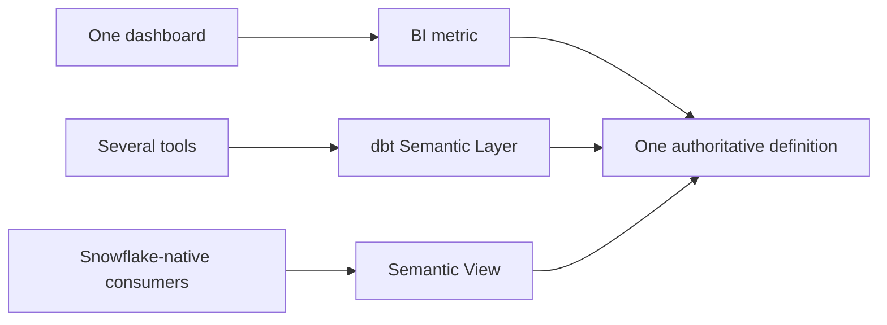
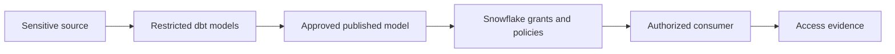
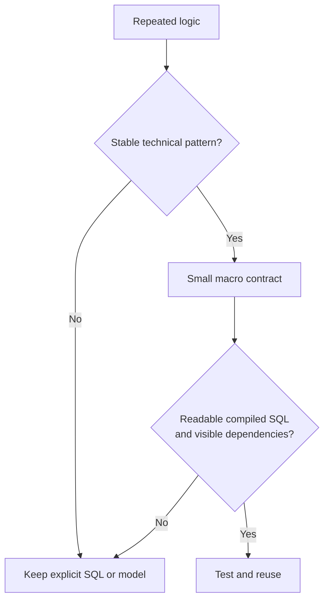

# dbt Topics 55-72 - Quick Teaching Summary

> A compact teaching pass through dbt governance, semantics, packages, Jinja, macros, tests, dispatch, hooks, and abstraction boundaries.

## Chapter 6 - Governance, Semantic Layer, and Mesh

### 55 - Semantic Models and Metrics

- A dbt model prepares trustworthy data, while a semantic model adds business meaning by declaring entities, dimensions, time behavior, and valid ways to query it.
- Metrics give governed names to calculations such as revenue or exposure, allowing MetricFlow to generate consistent SQL instead of every dashboard recreating the logic.
- The foundation still has to be correct: a semantic layer cannot repair duplicate keys, disputed grain, stale data, or an unclear currency and time basis.
- Recommend this when important metrics are reused across tools and have named business and technical owners, but keep a one-report calculation local until central governance creates real value.
- Snowflake still executes the generated query and enforces access, so metric governance must be paired with warehouse security, testing, reconciliation, and cost monitoring.

```yaml
models:
  - name: fct_trades
    semantic_model:
      enabled: true
    metrics:
      - name: settled_notional
        type: simple
        agg: sum
        expr: notional_amount
```

### 56 - Semantic Layer vs BI Metrics vs Snowflake Semantic Views

- BI metrics are closest to a particular dashboarding tool, dbt Semantic Layer metrics are designed for governed reuse through MetricFlow, and Snowflake Semantic Views are native Snowflake semantic objects.
- Choose the authoritative home based on the main consumers and operating model, not simply which feature list looks strongest.
- BI-local logic is reasonable for one report, dbt is attractive when several tools need the same dynamic KPI, and Snowflake Semantic Views fit Snowflake-native SQL, application, and AI consumption.
- Avoid maintaining the same KPI independently in all three places because even small differences in joins, dates, filters, or currency treatment will recreate inconsistency.
- During a migration, name the authoritative definition, reconcile the alternatives automatically, identify every consumer, and set an explicit retirement date.



### 57 - Metadata, Lineage, and Catalog Strategy

- dbt metadata describes declared project structure, dependencies, tests, owners, and execution artifacts, while Snowflake metadata observes physical objects, policies, queries, and access.
- BI platforms contribute dashboard and field lineage, and an enterprise catalog can connect these technical maps to business terms, stewardship, and cross-platform discovery.
- No single graph is automatically complete because declared lineage, observed execution, and business ownership answer different questions.
- Start with dbt documentation or Catalog for a local dbt need, then add Snowflake and enterprise metadata only when impact analysis, audit, incident response, or cross-tool discovery requires it.
- For every metadata field, decide which system is authoritative, how fresh it must be, who resolves conflicts, and how blind spots such as spreadsheets or dynamic SQL are handled.

### 58 - Domain Ownership in Banking

- Domain ownership gives teams such as Finance, Risk, Treasury, Markets, and Compliance responsibility for defined data products whose meaning they understand.
- It is federated rather than uncontrolled: domain teams own business rules and service quality inside centrally defined standards for security, metadata, deployment, and evidence.
- A domain boundary should follow stable accountability and reusable interfaces, not the latest organization chart or a desire to split repositories.
- dbt groups, public models, contracts, versions, and Mesh dependencies can support the model, but they cannot create ownership or operational maturity by themselves.
- Recommend domain ownership when teams can independently build and support stable products; retain a simpler centralized project when dependencies remain highly coupled or accountability is unresolved.

### 59 - Sensitive Data and Regulatory Boundaries

- dbt can transform PII, confidential client information, MNPI, and regulated figures into many new relations, so controls must follow the data rather than protect only the raw source.
- Keep sensitive staging and intermediate models private, publish only approved outputs, and minimize sensitive columns as early as business requirements allow.
- dbt metadata, model access, contracts, and tests describe ownership and intended use, while Snowflake RBAC, masking, row access policies, and tags provide enforceable security.
- Separate developer, CI, deployment, production, and consumer identities so convenience does not turn into uncontrolled production access.
- A bank-grade design also needs classification, lineage, approvals, query/access evidence, retention rules, incident ownership, and regular testing of the effective user experience.



## Chapter 7 - Packages, Macros, and Advanced Reuse

### 60 - Package Fundamentals

- A dbt package is another dbt project whose source code, macros, tests, models, or materializations become available inside the consuming project.
- Packages remove repeated technical plumbing, but they also expand the code, dependency, execution, and support surface that the client must govern.
- Use a package when it solves a recurring non-differentiating problem better than a small local implementation and has acceptable maintenance, license, compatibility, and ownership.
- Pin and lock the version, inspect what resources become enabled, review compiled SQL, and test the exact package against the chosen dbt runtime and adapter.
- Avoid a large or weakly maintained dependency for a tiny use case, sensitive business logic, or functionality already provided clearly by dbt or Snowflake.

### 61 - `packages.yml` vs `dependencies.yml`

- A package dependency shares source code that the consumer downloads and may execute, while a project dependency exposes a producer-owned public dataset that the consumer references.
- Both files can declare ordinary packages, but `dependencies.yml` is required for dbt Mesh project dependencies and can combine `packages:` with `projects:` entries.
- Keep `packages.yml` when package configuration requires Jinja, and use `dependencies.yml` when consuming public models across managed dbt projects.
- The memorable rule is: packages share implementation, while project dependencies share governed interfaces and leave upstream execution ownership with the producer.
- Do not install another domain's whole project as a package merely to query its final models, because that duplicates builds and blurs support and cost ownership.

```yaml
# dependencies.yml
packages:
  - package: dbt-labs/dbt_utils
    version: [">=1.3.0", "<2.0.0"]
projects:
  - name: finance_data_products
```

### 62 - Must-Have Utility Packages

- `dbt_utils` supplies common reusable macros and tests, `codegen` scaffolds repetitive YAML or SQL, and `audit_helper` compares old and new relations during migrations or refactors.
- These packages are valuable because they remove technical repetition, not because every project should install them automatically.
- Generated code is a starting point that must be reviewed, simplified, documented, and owned rather than accepted blindly.
- Relation comparisons can provide strong migration evidence, but large full-table comparisons may be expensive and should use appropriate keys, filters, tolerances, and reconciliation rules.
- Prefer native dbt or Snowflake capabilities when they express the requirement more clearly, and approve only the utilities the project genuinely uses.

### 63 - Data Quality Packages

- `dbt_expectations` provides many generic data tests, Elementary adds anomaly and observability capabilities, and `dbt_project_evaluator` checks whether the dbt project follows selected engineering conventions.
- These tools cover different quality layers: deterministic data rules, adaptive operational signals, and project hygiene should not be treated as interchangeable.
- More tests are not automatically better because poorly chosen tests create noise, alert fatigue, metadata storage, and repeated Snowflake scans.
- In finance, deterministic reconciliations and material controls still need explicit thresholds, owners, failure handling, and evidence even when anomaly detection is present.
- Check maintenance status and runtime compatibility before adoption, especially because a familiar package can become inactive or unsupported over time.

### 64 - Snowflake and Operations Packages

- Snowflake-focused packages can add query tags, model Account Usage telemetry, or operate external tables, but each solves a narrow problem rather than complete platform governance.
- Query tags help connect Snowflake queries to dbt projects, nodes, environments, and owners so cost or incidents can be attributed more accurately.
- Monitoring packages turn Snowflake metadata into reusable models, but Account Usage latency, retention, permissions, and warehouse cost still shape what they can prove.
- External-table packages perform warehouse operations and therefore need explicit privileges, ownership, retry behavior, and alignment with the ingestion platform.
- Recommend these packages only when their operational model improves on a simpler native solution and the team accepts the Snowflake-specific support boundary.

### 65 - Finance and Bank-Relevant Packages

- Finance-relevant categories include Data Vault automation, reconciliation helpers, constraints, observability, metadata checks, and Snowflake cost-attribution packages.
- A Data Vault package can automate a modeling method, but the client must first choose that method deliberately and understand that different packages encode different conventions.
- Packages may implement the mechanism for comparison, historization, or monitoring, while the bank remains accountable for the control objective, business meaning, thresholds, approval, and evidence.
- Regulated adoption requires maintenance, license, security, version pinning, dbt/Fusion and Snowflake compatibility, generated-code review, and a credible support or fork plan.
- Avoid any package that dictates an unchosen architecture, hides material business rules, or creates more model and operational risk than the repetition it removes.

### 66 - Package Governance

- Package governance is the full lifecycle for discovering, approving, installing, locking, testing, upgrading, monitoring, forking, and removing dependencies.
- The declaration file records what is allowed, `package-lock.yml` records what was resolved, and CI demonstrates whether that exact dependency behaves acceptably.
- Approval should document the use case, repository, maintainer, license, version, transitive dependencies, generated resources, required privileges, compatibility, and internal owner.
- Upgrades need the same discipline as first adoption because maintainers, behavior, dependencies, and runtime support can change even when the package name stays familiar.
- Every production package needs an exit strategy: replace it, pin temporarily, take ownership of a fork, or remove the capability when support risk becomes unacceptable.

### 67 - Jinja Fundamentals

- Jinja runs while dbt renders a project, before Snowflake receives the final SQL, so loops and conditions are code-generation tools rather than warehouse runtime logic.
- `{{ ... }}` prints a value such as `ref()`, while `` controls statements such as `set`, `for`, and `if`.
- Jinja is useful for explicit dependencies, small environment differences, and mechanical repetition, but the compiled SQL remains the real product that must be reviewed and tuned.
- Keep business semantics consistent across targets and avoid templates that require a reviewer to mentally execute a complex program.
- If Jinja hides relation dependencies, queries the warehouse unexpectedly, or produces unreadable SQL, simpler explicit SQL is the better design.

```sql
-- dbt source
select * from {{ ref('stg_payments') }}

-- Snowflake receives a compiled relation name, not ref().
```

### 68 - Macros as Reusable SQL Functions

- A macro is reusable Jinja, normally stored under `macros/`, that generates SQL or returns a value during dbt compilation.
- Good macros centralize stable technical policies such as standard expressions, identifiers, or repetitive column generation behind a small clear interface.
- A macro is not a warehouse function and does not execute once per row; it expands into the SQL that the warehouse later runs.
- Keep a model's essential business grain and transformation logic visible, because hiding it behind flags and nested macro calls makes review and debugging harder.
- Extract a macro only after a genuine repeated pattern is stable, then test representative inputs and inspect the compiled result.

### 69 - Custom Generic Tests

- A custom generic test is a parameterized Jinja `test` block that can apply the same data rule to several models, columns, sources, seeds, or snapshots.
- The test query should return the failing rows, so success normally means that the query returns zero records.
- Use one when the same well-defined assertion repeats and the returned failure evidence helps an owner diagnose the problem.
- Prefer a singular test for a one-off rule, a unit test for controlled transformation logic, and a reconciliation model when several business-specific relations must be compared.
- Control warehouse cost with selective application, sensible filters, appropriate cadence, and severity that matches the business impact.

```sql

select *
from {{ model }}
where {{ column_name }} < 0

```

### 70 - Adapter Dispatch

- Adapter dispatch lets one public macro name resolve to a warehouse-specific implementation such as `snowflake__calculate_value` or a portable `default__calculate_value` fallback.
- It is useful when the same semantic operation must work across platforms whose SQL syntax or behavior genuinely differs.
- Keep the public interface stable and place only the unavoidable dialect-specific logic behind adapter-prefixed implementations.
- Portability is a contract, so each supported adapter needs tests proving that the implementations mean the same thing rather than merely compiling successfully.
- Avoid dispatch in a Snowflake-only project unless a real extension point exists, because hypothetical portability adds indirection without current value.

```text
calculate_value()
  -> snowflake__calculate_value()  # Snowflake target
  -> default__calculate_value()    # fallback
```

### 71 - Hooks and Operations

- Hooks run SQL automatically before or after a model or dbt invocation, while `dbt run-operation` invokes a macro deliberately as an administrative action.
- Use hooks for narrow lifecycle behavior and operations for version-controlled runbook tasks with explicit arguments and authorization.
- Prefer built-in grants, models, tests, or configuration when they express the requirement, because hooks are less visible in the DAG and can create hidden side effects.
- Any side effect should be idempotent, least-privileged, observable, safe to retry, and clear about transaction and partial-failure behavior.
- Cross-system orchestration, destructive administration, and complex retries belong in an orchestrator, migration process, or controlled platform runbook rather than an expanding hook framework.

```bash
dbt run-operation apply_approved_maintenance \
  --args '{change_id: CHG-1042}'
```

### 72 - Advanced Macro Boundaries

- The purpose of a macro boundary is to decide which stable technical logic deserves reuse and which logic should remain explicit in SQL, a model, a test, or an operational workflow.
- Good abstraction reduces repeated change risk, while bad abstraction merely makes the source file shorter and the compiled behavior harder to understand.
- Warning signs include many mode flags, hidden `ref()` dependencies, unexpected warehouse queries, adapter branches without tests, and business grain concealed inside a mini-framework.
- A useful macro has a small contract, deterministic behavior, readable compiled SQL, representative tests, documented limitations, and an accountable owner.
- When the abstraction costs more to explain, debug, audit, and upgrade than the duplication it removes, simplify it or return the logic to explicit models.



## Continue With the Full Notes

- [[02 dbt/06 Governance Semantic Layer and Mesh/Governance Semantic Layer and Mesh Overview]]
- [[02 dbt/07 Packages Macros and Advanced Reuse/Packages Macros and Advanced Reuse Overview]]
- [[80 Comparisons and Decision Notes/Comparisons and Decision Notes Overview]]
